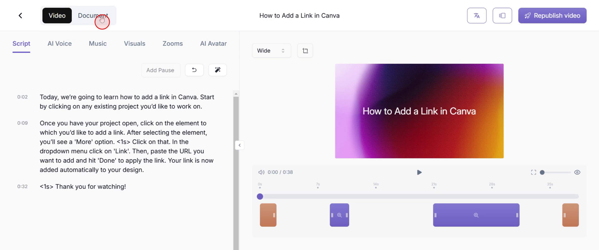
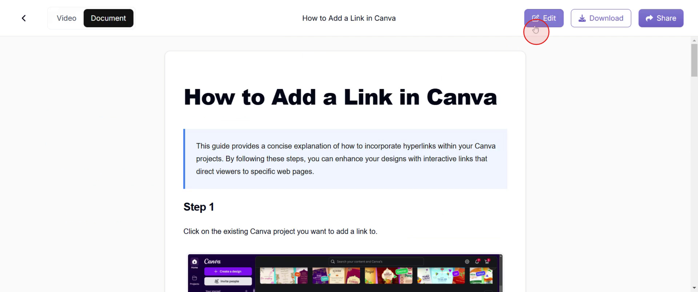
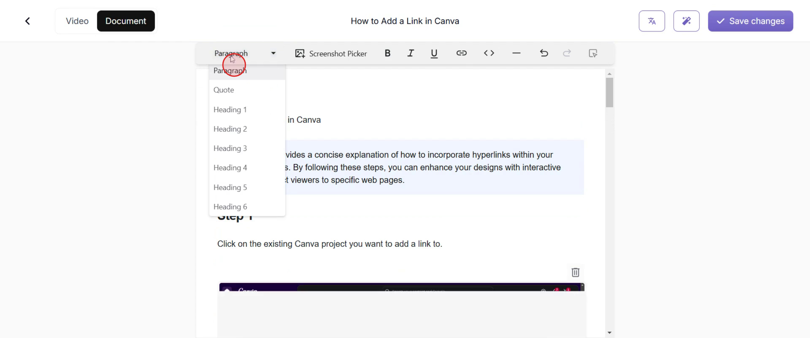
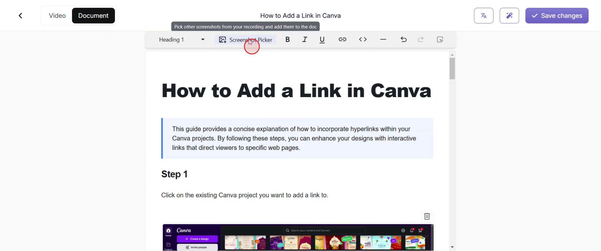
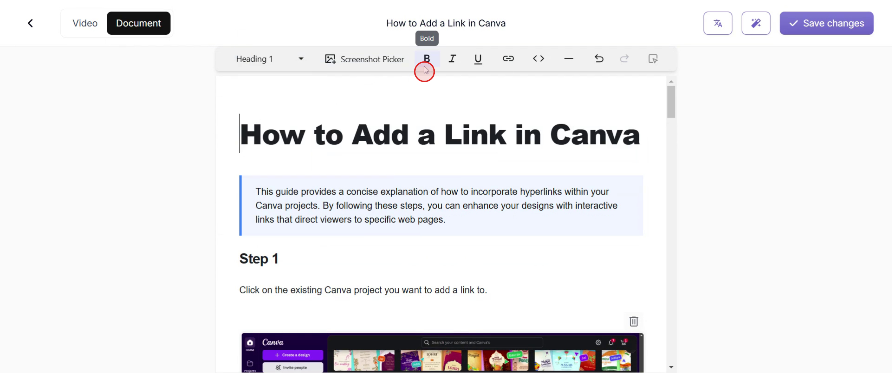
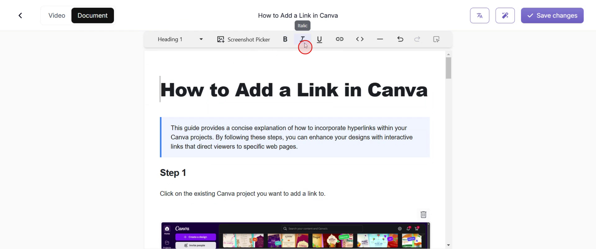
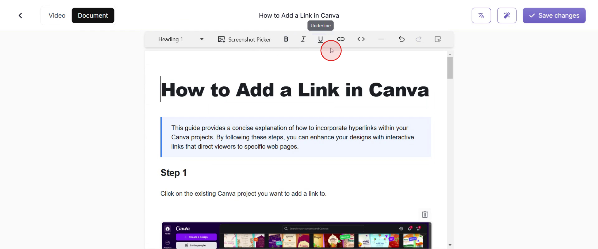
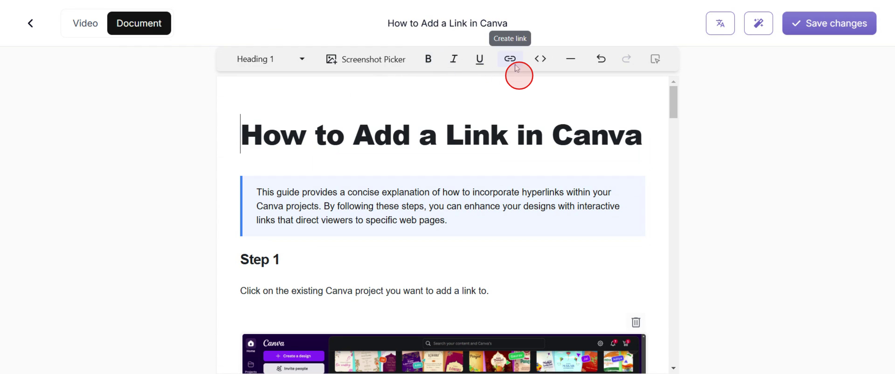
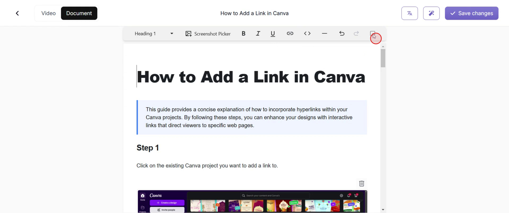

<iframe
  src="https://app.trupeer.ai/embed?slug=lkkaQd"
  className="w-full aspect-video rounded-lg overflow-hidden"
  frameborder="0"
  allowfullscreen="true"
></iframe>

This document outlines the process of editing documents within the Trupeer platform. It provides a step-by-step guide on using various editing tools available in the software after generating a video.

## Step 1: Accessing the Document Editor

Locate and click on the 'Document' option.

## Step 2: Initiating Edit Mode

Once you open the document, find the 'Edit' button and click on it.

## Step 3: Using Basic Document Elements

The options shown in the screenshot below include adding a paragraph, inserting a quote, and making various other edits.

## Step 4: Screenshot Editing Overview

Additional editing options include editing a screenshot.

## Step 5: Applying Bold Formatting

To apply bold formatting, simply highlight the text you want to emphasize and click the **Bold (B)** option in the editing toolbar.

## Step 6: Using Italic Formatting

To convert text to italic, highlight the desired text and click on the _Italic (I)_ option in the editing toolbar.

## Step 7: Adding Underline Formatting

To underline text, highlight the desired text and click on the Underline (U) option in the editing toolbar.

## Step 8: Creating Hyperlinks

To turn a normal text or word into a hyperlink, use the "Link" option in the editing toolbar.

## Step 9: Using the Screenshot Editor

To edit a screenshot, select the image and click on the "Screenshot Editor" option in the toolbar.

That's it! This is how you can easily edit documents in Trupeer.
