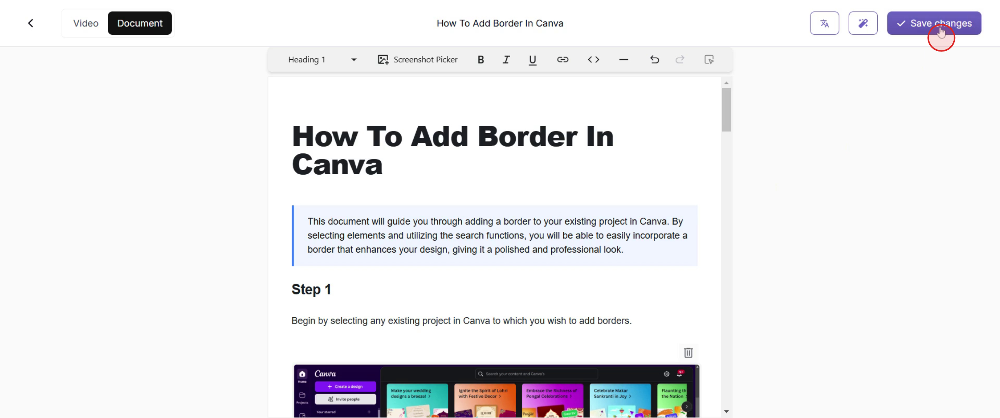
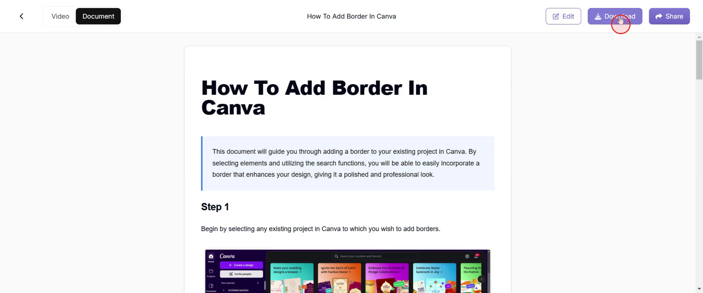
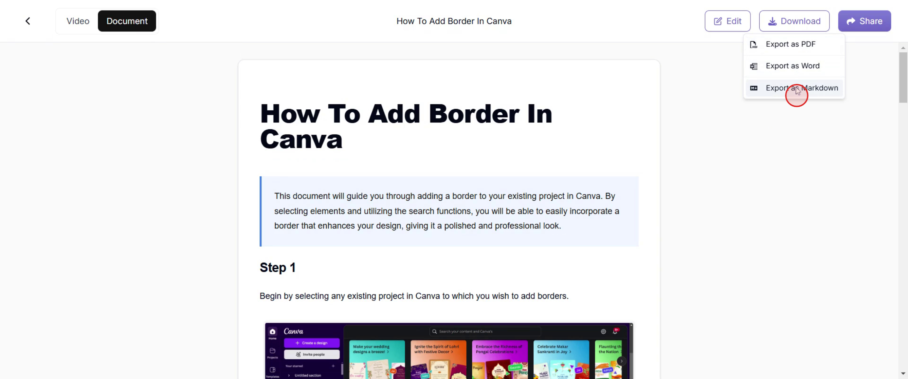

<iframe
  src="https://app.trupeer.ai/embed?slug=Vc5lgA"
  className="w-full aspect-video rounded-lg overflow-hidden"
  frameborder="0"
  allowfullscreen="true"
></iframe>

This guide will walk you through the steps to download a document in Trupeer. You'll learn how to save your changes, select the download option, and choose your preferred document format.

#####

### Step 1

Click on the "Save Changes" option.

### Step 2

Go and click on the "Download" option that appears.

### Step 3

Finally, choose your preferred format to download the document. Options include PDF, Word, or export as a Markdown format.

