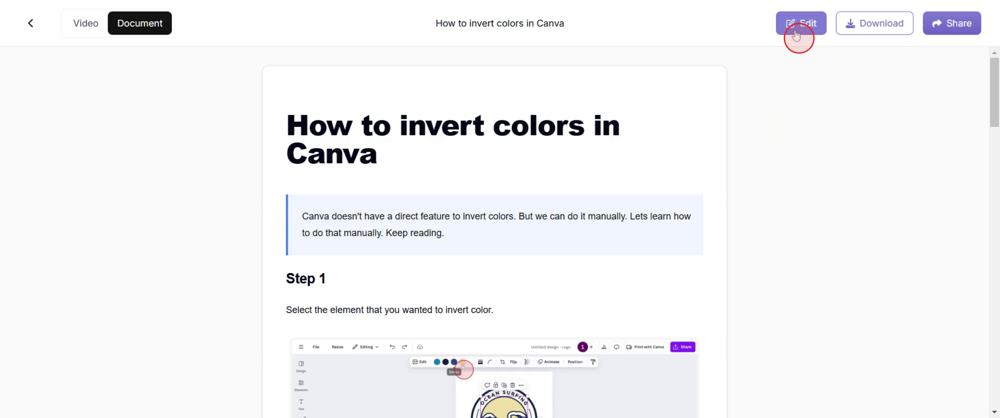
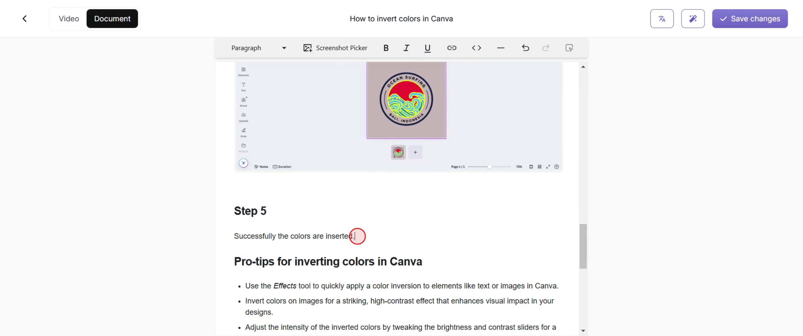
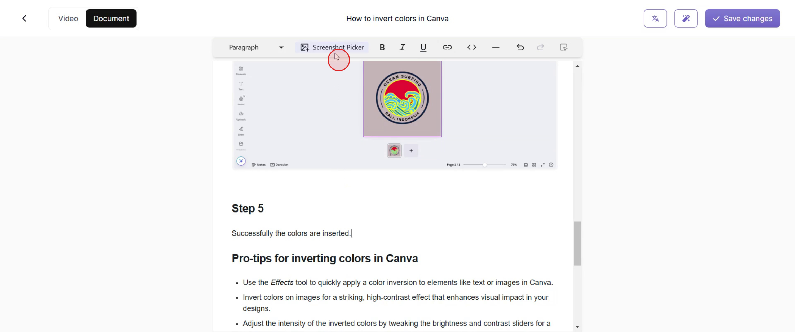
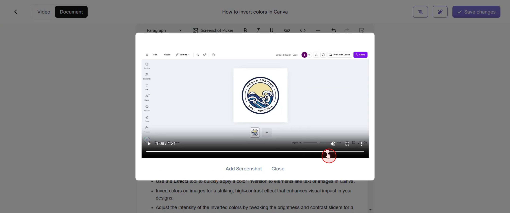
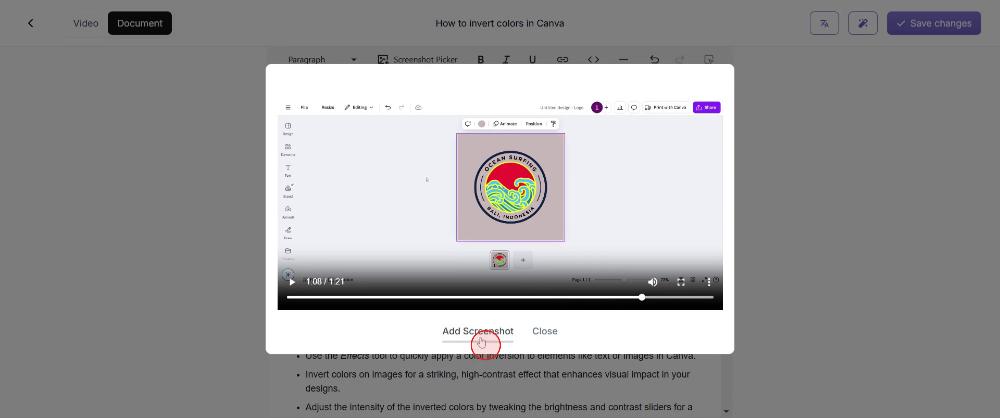
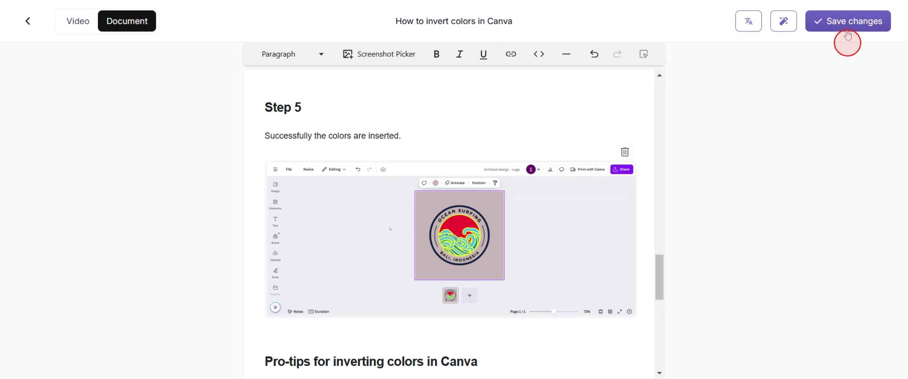

<iframe
  src="https://app.trupeer.ai/embed?slug=a962fg"
  className="w-full aspect-video rounded-lg overflow-hidden"
  frameborder="0"
  allowfullscreen="true"
></iframe>

This process offers a simple method to insert screenshots into your document, allowing you to enhance your content visually. Follow these steps to seamlessly integrate images where necessary.

### Step 1: Opening the Document Editor

Go to the "Edit" option and click on it.

### Step 2: Positioning Your Cursor

Next, position the cursor at the desired location within the document where you wish to insert the screenshot.

### Step 3: Opening the Screenshot Picker

Proceed to access the screenshot picker by clicking on it.

### Step 4: Choosing the Screenshot Location

Select the precise location for your screenshot.

### Step 5: Confirming Screenshot Selection

Click on "Add Screenshot."

### Step 6: Saving Your Changes

If you are satisfied, click on "Save Changes" to preserve your edits.

