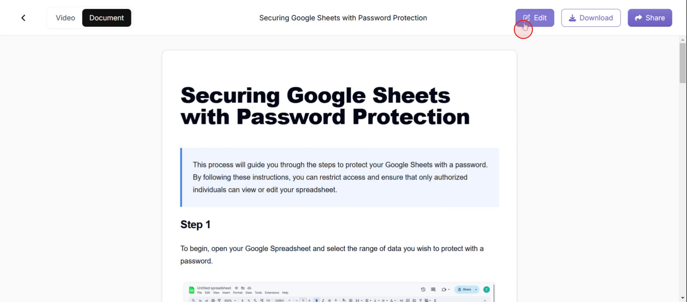
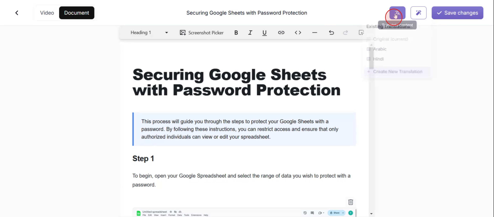
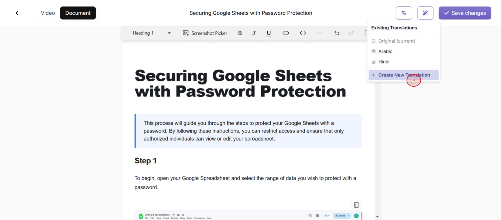
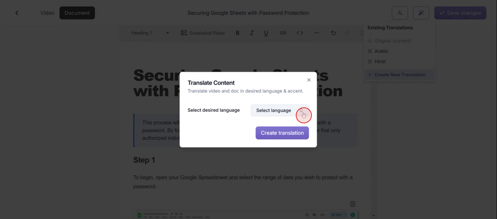
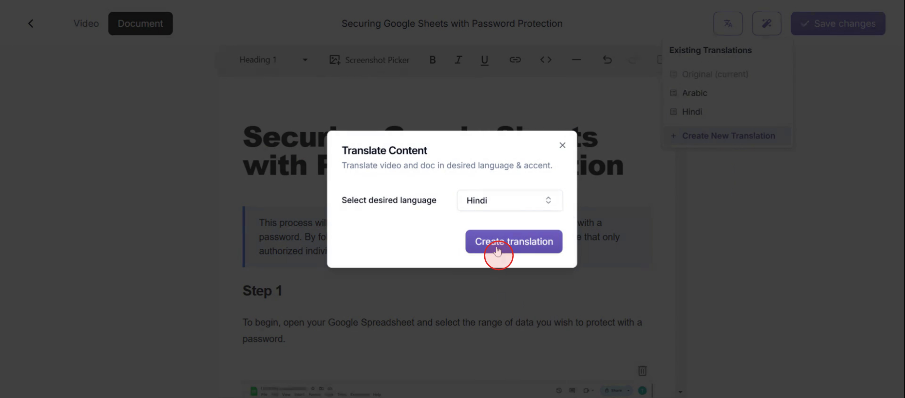

<iframe
  src="https://app.trupeer.ai/embed?slug=wbDUK9"
  className="w-full aspect-video rounded-lg overflow-hidden"
  frameborder="0"
  allowfullscreen="true"
></iframe>

This document provides a detailed explanation on how to translate a document into another language. The process involves a few straightforward steps, allowing users to easily convert their documents into the desired language.

### Step 1

Click on the **Edit** option.

### Step 2

And click on **the translate content** option.

### Step 3

Now to add a new language click on **create a new translation** option.

### Step 4

Select the **language**,

### Step 5

Click on **Create Translation**.

