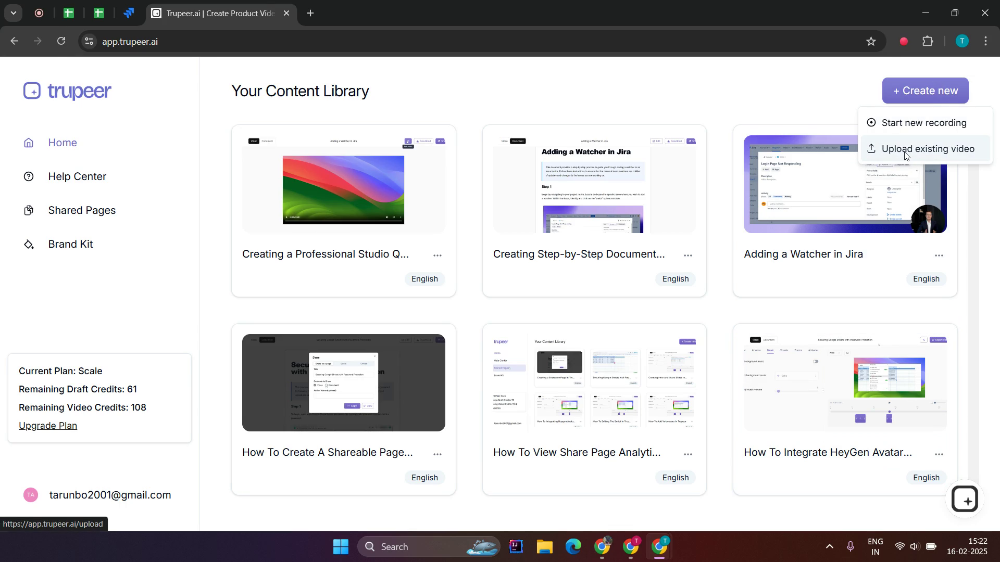

<iframe
  src="https://www.youtube.com/embed/OrXK8RgVlHU"
  title="Trupeer.ai Platform Walkthrough"
  className="w-full aspect-video rounded-lg overflow-hidden"
  frameborder="0"
  allowfullscreen="true"
  allow="accelerometer; autoplay; clipboard-write; encrypted-media; gyroscope; picture-in-picture; web-share"
  referrerpolicy="strict-origin-when-cross-origin"
  hidden="true"
></iframe>

Welcome to Trupeer! This guide will walk you through the process of creating and publishing your first video. Let's get started with the basic steps.

## Authentication

1. Visit [https://app.trupeer.ai/auth](https://app.trupeer.ai/auth)
2. You have two options to sign in:
   - Email and Password
   - Google Sign-In

## Installing Chrome Extension

Before creating your first video, you'll need to install our Chrome extension:

1. Visit the [Trupeer Chrome Extension](https://chromewebstore.google.com/detail/trupeer-ai-screen-recorde/doedlfgeilocafjipkkhegndbhlkoedo) page
2. Click "Add to Chrome" to install
3. The extension will appear in your Chrome toolbar, ready for screen recording

Key extension features:

- Screen, microphone, and internal audio recording
- Full screen, window, or tab recording options
- Direct integration with Trupeer's AI video editor

## Getting Started

After successful authentication, you'll be directed to your dashboard where you can:

1. View your previous recordings
2. Create new content
3. Access your shared content

## Creating Your First Video

To start creating a new video:

1. Look for the "Create New" button in the top-right corner of your dashboard
2. Click on it to see two options:
   - [Record New Video](/getting-started/screen-record): Start a fresh screen recording
   - [Upload Existing Video](/getting-started/upload-recordings): Import a pre-recorded video

Follow our detailed guides to learn more about:

- [Video Creation & Editing](/video-features/edit-script): How to enhance your videos with AI-powered features.

- [Document Creation & Editing](/document-features/editing-documents): Create and customize AI-generated documentation.

- [Sharing & Analytics](/sharing-your-content/create-page): Share your content with your audience and track its performance.
