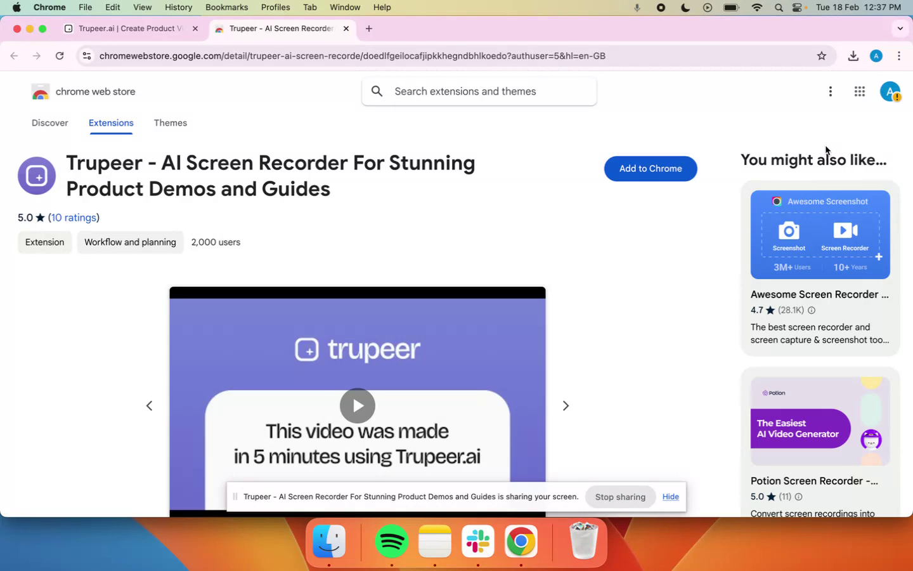
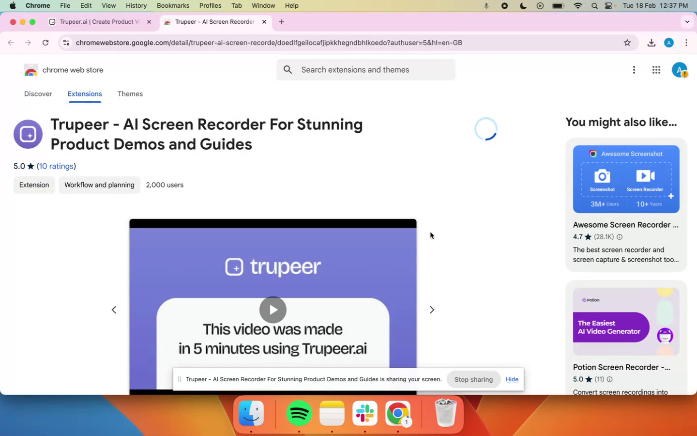
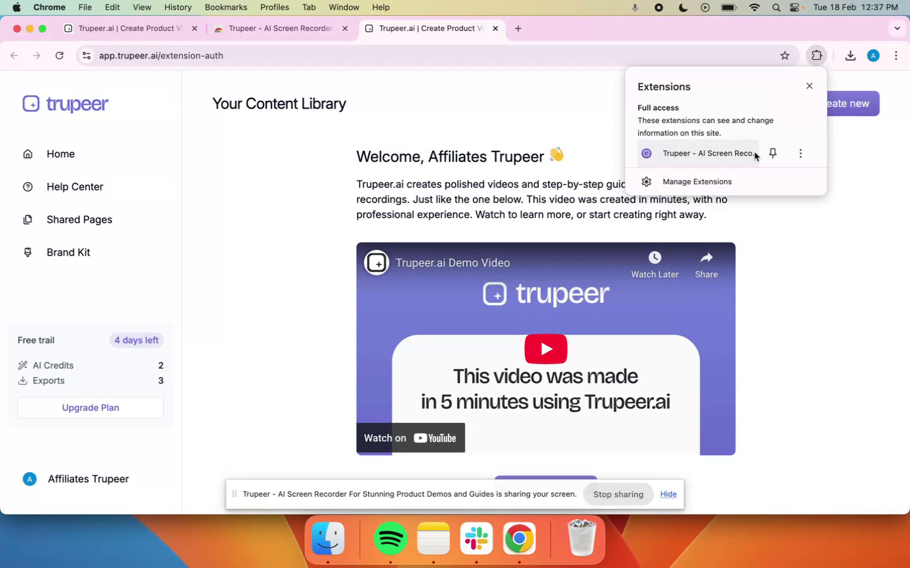
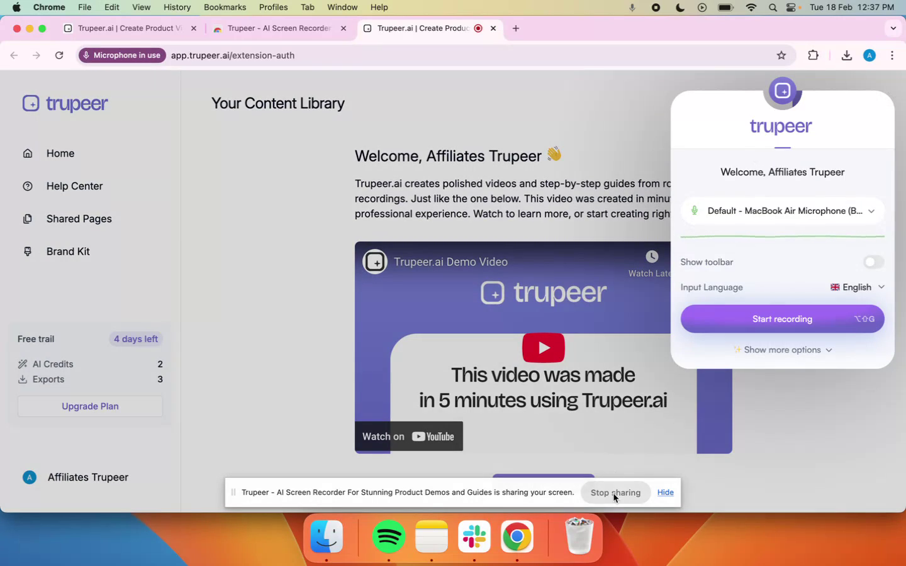

<iframe
  src="https://app.trupeer.ai/embed?slug=00yqoe"
  className="w-full aspect-video rounded-lg overflow-hidden"
  frameborder="0"
  allowfullscreen="true"
></iframe>

This process outlines the steps to download and use the Truepeer Chrome extension from the Chrome Web Store. Follow these instructions to successfully integrate and activate the extension for your browser, enabling you to start recording videos seamlessly.

### Step 1

Begin by navigating to the 'Create Now' section in your web interface. Click on the 'Start New Recording' button to proceed.

### Step 2

You will be redirected to the Chrome Web Store. Click the 'Add to Chrome' button, followed by selecting 'Add Extension' to initiate the installation process.

### Step 3

The Truepeer Chrome extension will automatically begin downloading and subsequently activate. To create a video, simply click on the Truepeer Chrome extension icon within your browser.

### Step 4

Once clicked, you will have the capability to start recording your videos. Thank you for following this process.

