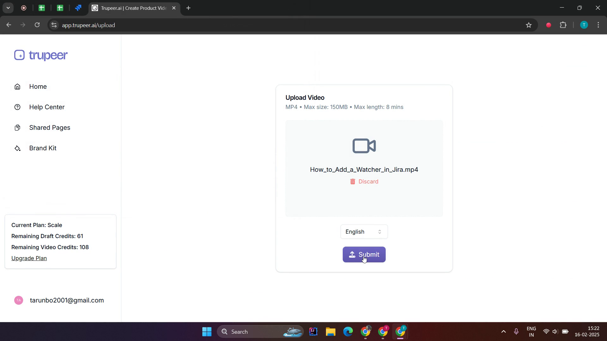

<iframe
  src="https://app.trupeer.ai/embed?slug=t0yhcH"
  className="w-full aspect-video rounded-lg overflow-hidden"
  frameborder="0"
  allowfullscreen="true"
></iframe>

This guide provides step-by-step instructions on how to upload an existing video to the Trupeer platform. Follow these steps to easily navigate through the process.

### Step 1: Access the Create Menu

Click on **Create New.**

### Step 2: Select Upload Option

Then **choose upload existing video**.

### Step 3: Submit Your Video

Once you have selected the file from your file manager, proceed by clicking on **Submit**.

