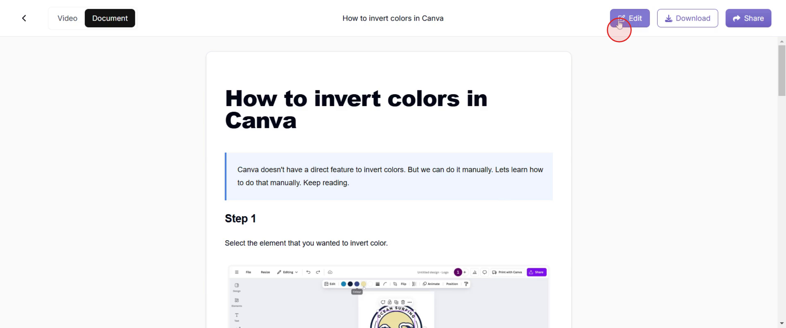
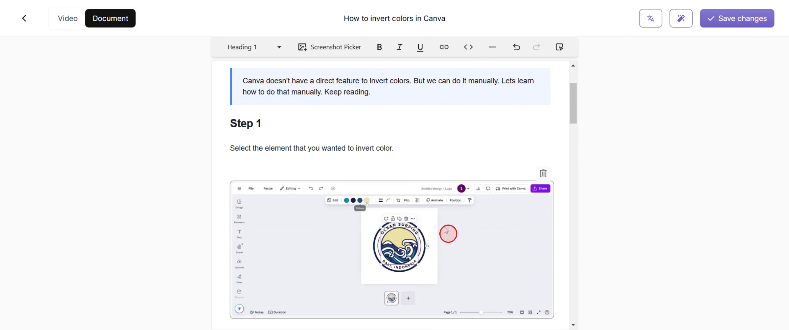
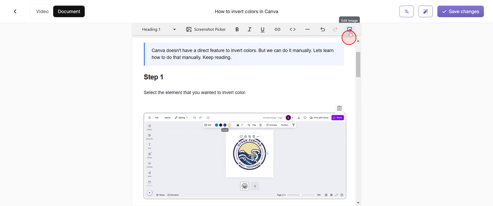
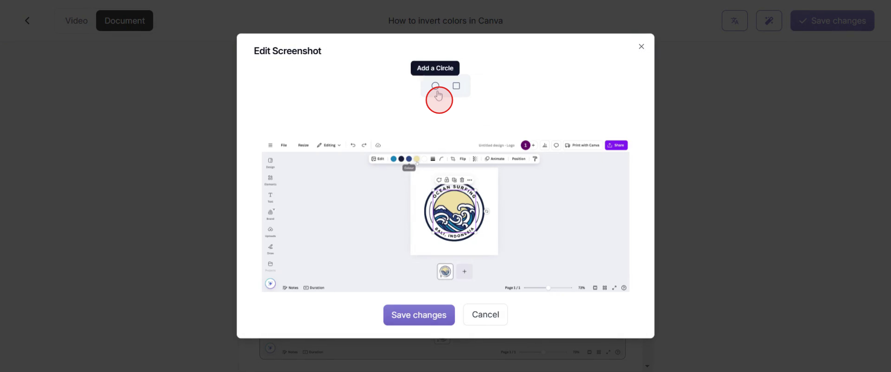
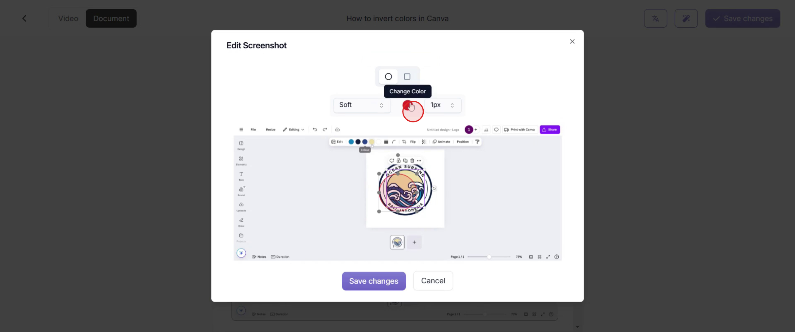
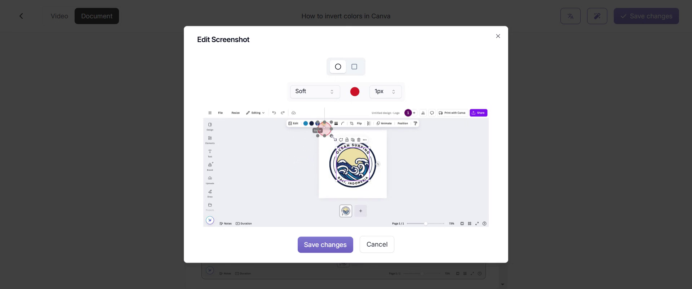
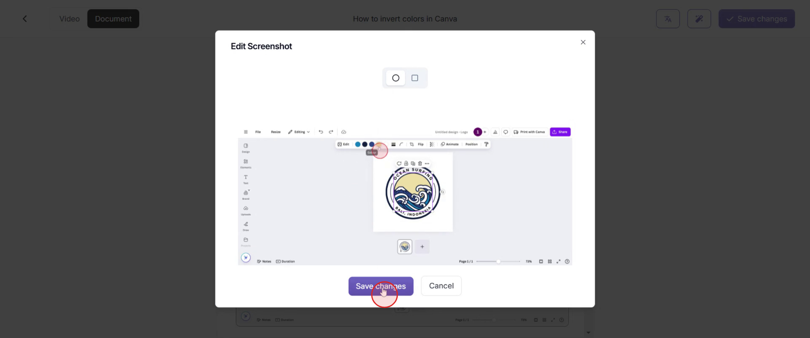

This document provides clear instructions on how to add annotations to screenshots. Follow the steps to effectively edit and enhance your images with various annotation tools such as circles, rectangles, and color adjustments.

### Step 1

Go to the "Edit" option and click on it.

### Step 2

Click on the screenshot where you want to add an annotation.

### Step 3

After that, click on the "Edit Photo" option.

### Step 4

Select the desired style that best matches your needs.

### Step 5

Adjust the fill style and color of the annotations.

### Step 6

You can adjust the width and placement of these elements to suit your preferences, ensuring the annotations are positioned accurately where needed.

### Step 7

Once satisfied with the changes, click on the save changes option.

