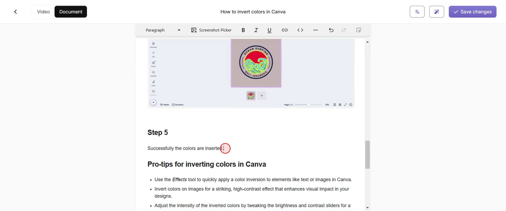
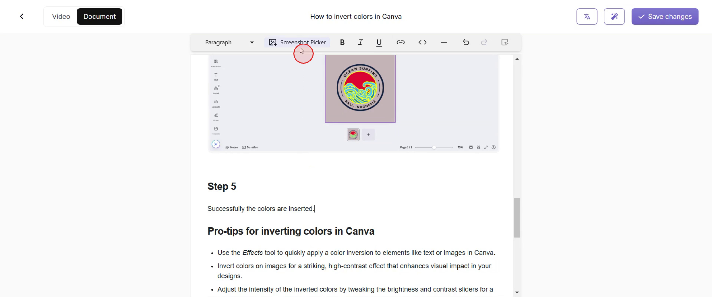
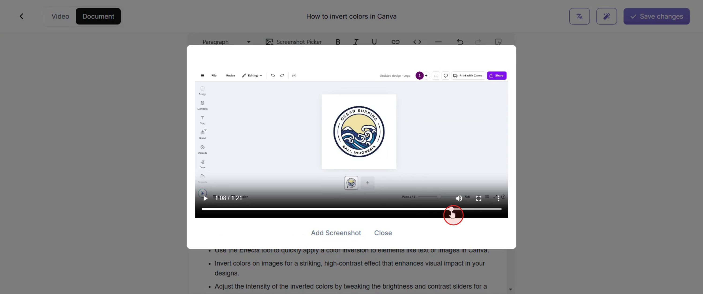
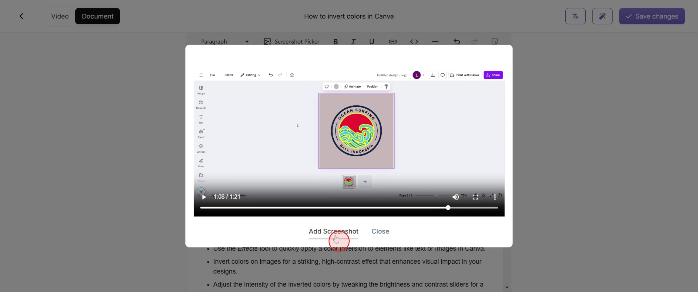
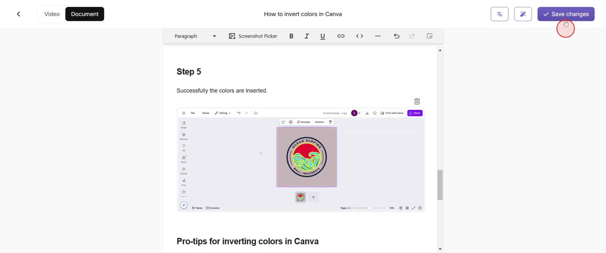

This process offers a simple method to insert screenshots into your document, allowing you to enhance your content visually. Follow these steps to seamlessly integrate images where necessary.

### Step 1

Go to the "Edit" option and click on it.

### Step 2

Next, position the cursor at the desired location within the document where you wish to insert the screenshot.

### Step 3

Proceed to access the screenshot picker by clicking on it.

### Step 4

Select the precise location for your screenshot.

### Step 5

Click on "Add Screenshot."

### Step 6

If you are satisfied, click on "Save Changes" to preserve your edits.

