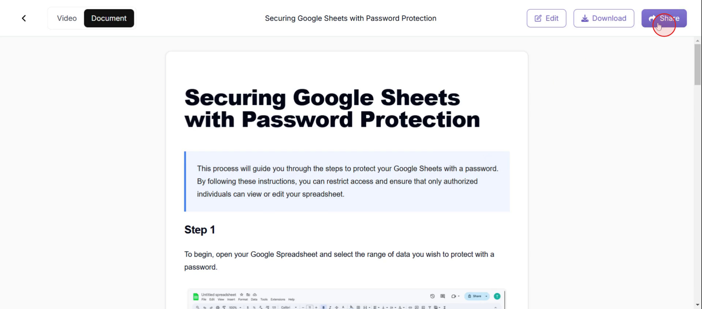

This document provides a step-by-step guide to creating a shareable page in Trupeer. It covers selecting content, customizing sharing options, and generating an embed code for seamless integration with social media platforms or websites.

### Step 1

Click on the **Share** option.

### Step 2

And select **share as page feature**.

### Step 3

Then enter a **title that suits** your requirements,

### Step 4

Then, select the video and document content you wish to share.

### Step 5

Click on **save Changes**.

### Step 6

Then click **on social option**,

### Step 7

Then choose a **platform to share** the document.

### Step 8

Click on **Embed**,

### Step 9

And **click on copy**.

