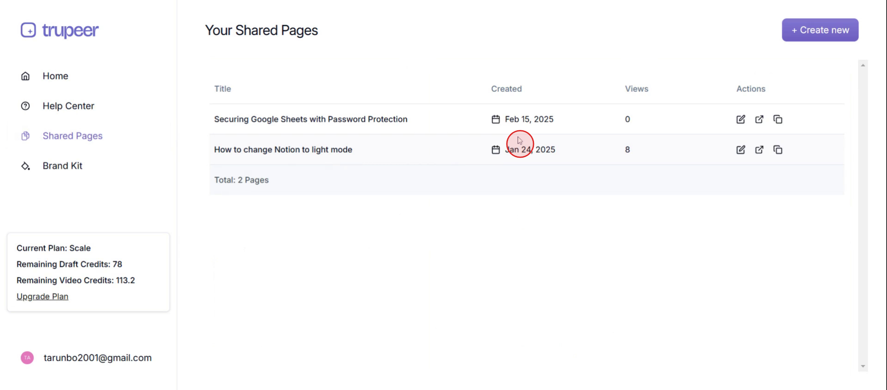
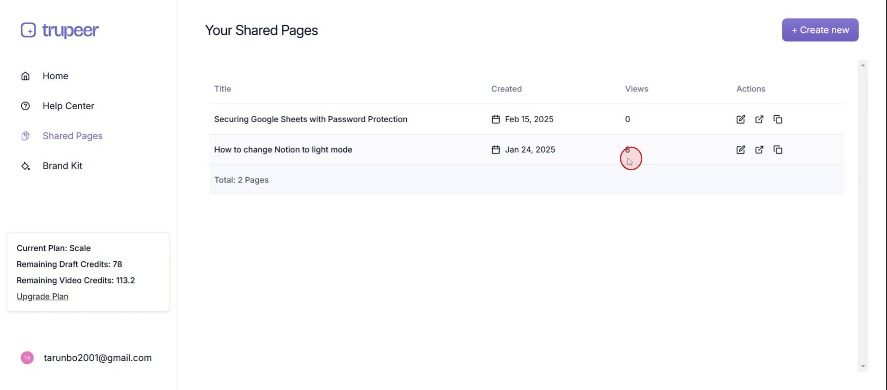
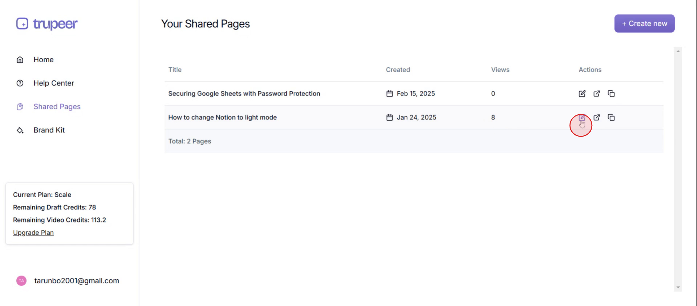

<iframe
  src="https://app.trupeer.ai/embed?slug=fyHYTj"
  className="w-full aspect-video rounded-lg overflow-hidden"
  frameborder="0"
  allowfullscreen="true"
></iframe>

This document offers a step-by-step guide on accessing and analyzing the analytics of shared pages in Trupeer. It walks you through navigating to the shared pages section, viewing page details, and using available actions like editing or copying page links.

### Step 1

Click on the **shared pages**.

### Step 2

Then you can see the **page created date**.

### Step 3

And you can see the **views of the particular** **page**,

### Step 4

Next, click on the Actions tab, where you can edit, share, or copy the page.

