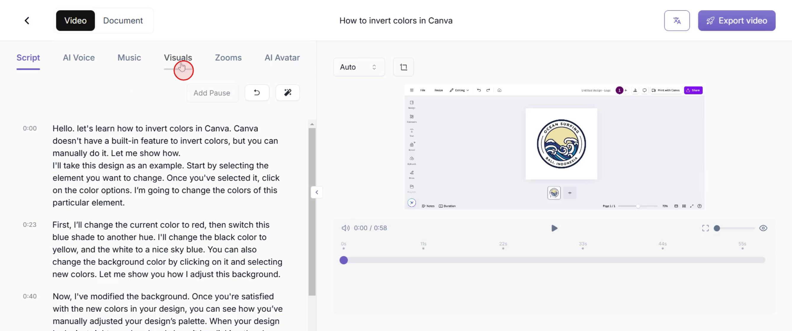
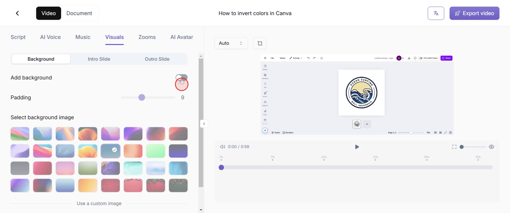
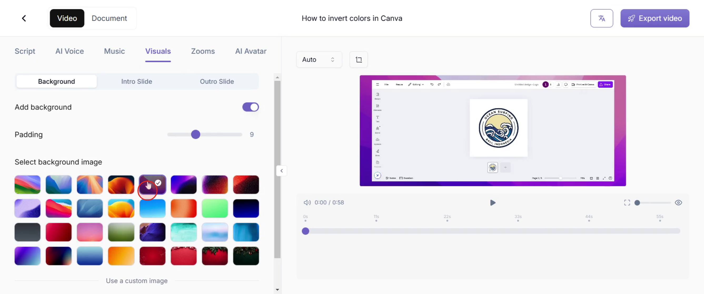
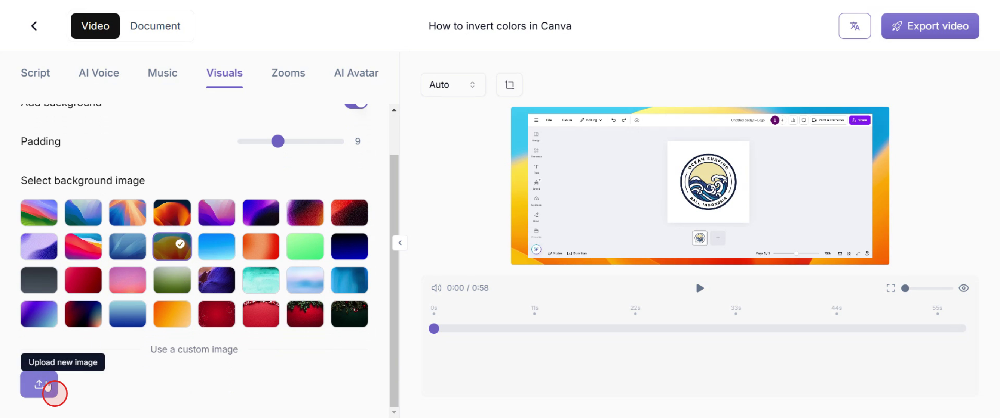
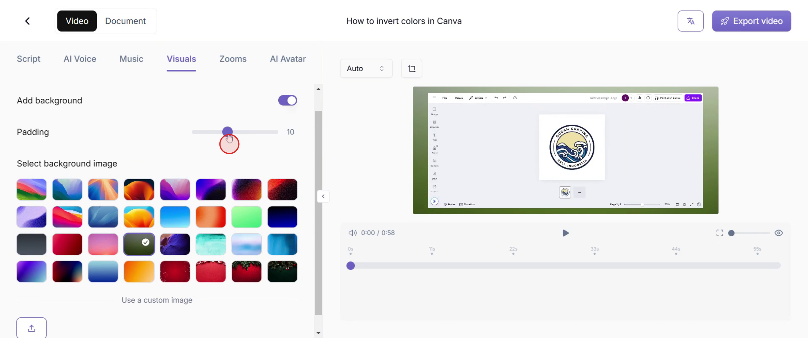

This guide will walk you through the process of adding a background in Trupeer. Now you can customize the background using pre-existing images or by uploading your own. Additionally, you can adjust padding settings to refine the final appearance to your preference.

### Step 1

To begin, go to the 'Visuals' option and select it.

### Step 2

Find the 'Add Background' option and toggle it on.

### Step 3

Choose a background image from the available options that best suits your preference.

### Step 4

Alternatively, select the 'Upload a New Image' option to add a custom background of your choice.

### Step 5

Finally, fine-tune the padding settings to achieve the desired look, completing the background customization process.

This is how you can add background in Trupeer.
