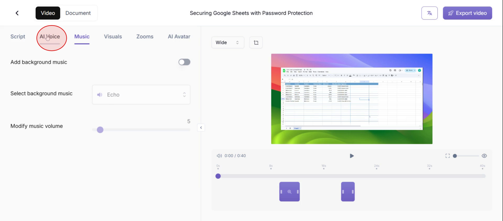
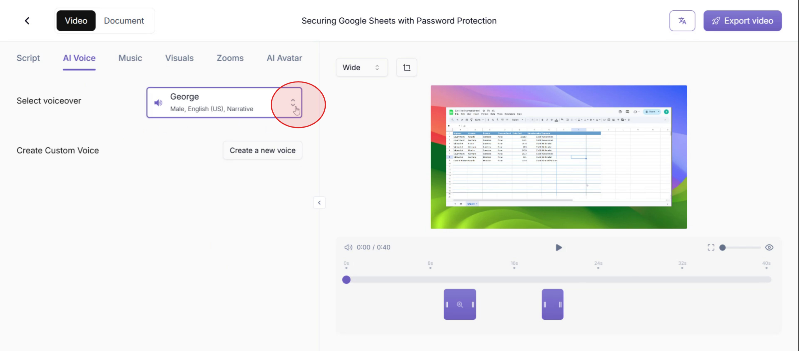
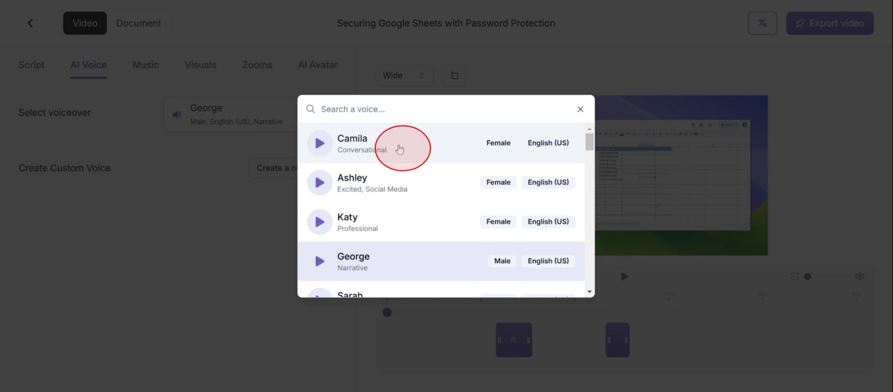
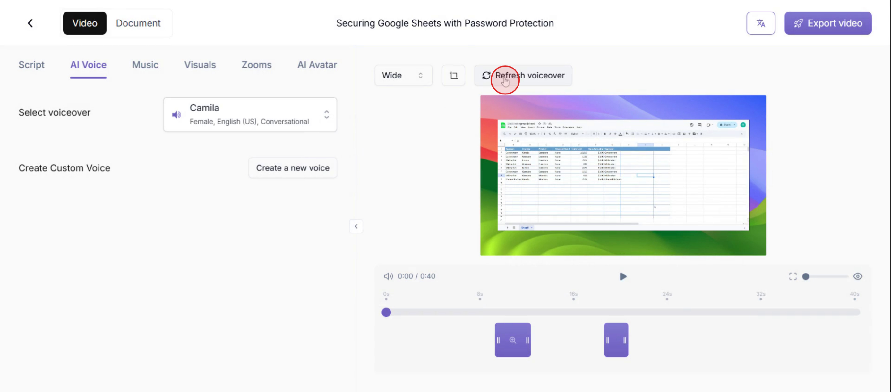
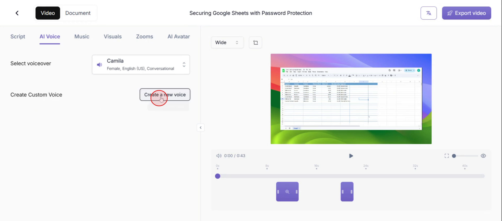
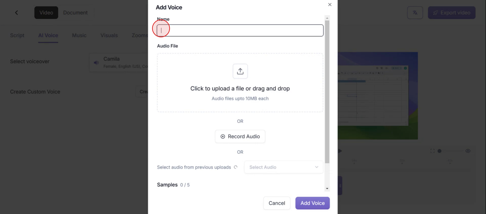
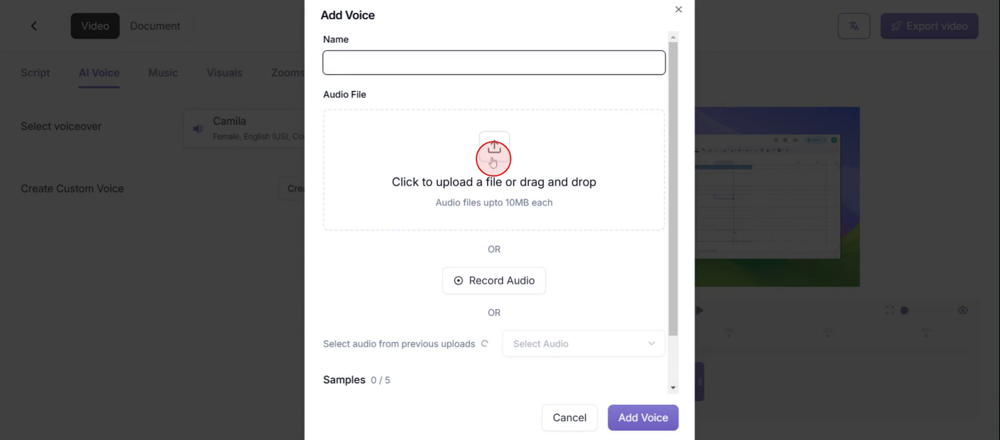
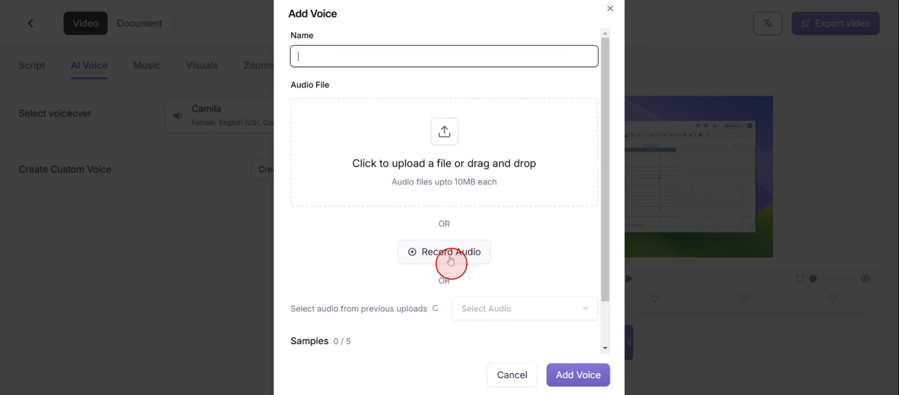
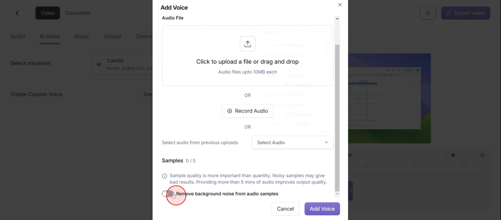
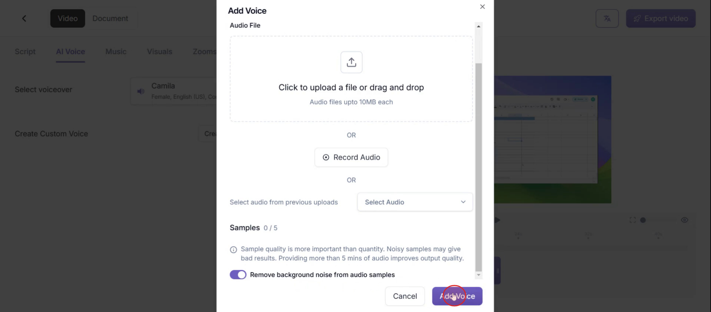

This guide offers a detailed walkthrough on adding voiceovers in Trupeer. You'll learn how to choose and update voices, create custom voiceovers, and remove background noise to achieve a crisp, professional sound.

### Step 1

Click on **AI Voice** to start the process.

### Step 2

Proceed by clicking on the **drop-down menu u**nder the **Select Voiceover** section.

### Step 3

Then choose the voiceover based on your desire.

### Step 4

And click on **Refresh Voiceover** option on the right side.

### Step 5

To crate your own voiceover, click on **Create a new voice**.

### Step 6

Enter a **name** for your custom voice.

### Step 7

You can **upload** a voice from the menu.

### Step 8

Or then, click on **Record Audio**.

###  Step 9

To remove background noise, activate the option **Remove background noise from audio samples**.

### Step 10

Finally, Click on the **Add voice** option and you voice will be added.

