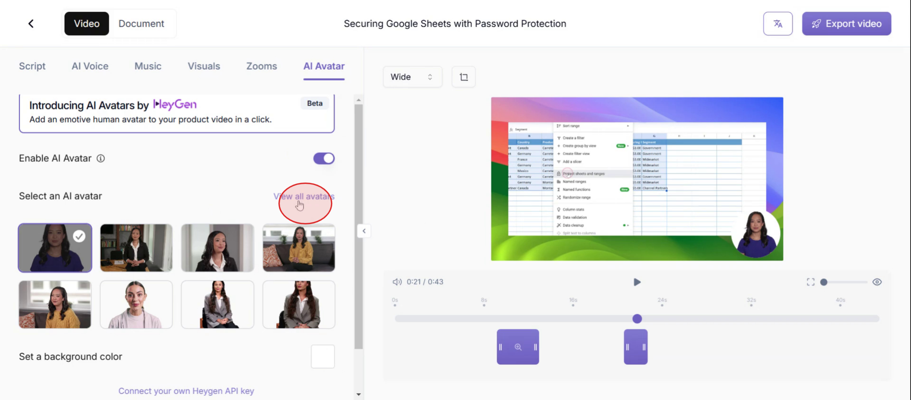

<iframe
  src="https://app.trupeer.ai/embed?slug=pNWUZM"
  className="w-full aspect-video rounded-lg overflow-hidden"
  frameborder="0"
  allowfullscreen="true"
></iframe>

In this tutorial, you'll discover how to effortlessly integrate a Heygen avatar into Trupeer. The process includes connecting your API key, enabling avatar options, and choosing the ideal avatar for your needs. Follow these steps to elevate your video content with personalized avatars.

### Step 1: Navigate to AI Avatar Settings

Click on AI Avatar option

### Step 2: Access API Key Connection

Click on **connect your own Heygen** API key at the bottom of the page.

### Step 3: Obtain Heygen API Key

Select the option of **Get your own API key**.

### Step 4: Enter API Key

Then paste it in the API Key section as shown in the screenshot.

### Step 5: Confirm API Key

And click on **Submit Key**.

### Step 6: Return to Main Menu

And select the **Go Back** option.

### Step 7: Enable AI Avatar Feature

Then click on enable AI avatar.

### Step 8: Browse Avatar Collection

Click on **view all avatars**.

### Step 9: Choose Your Avatar

Select the avatar that best suits your requirements.

Thats how you can integrate HeyGen avatars in Trupeer.
