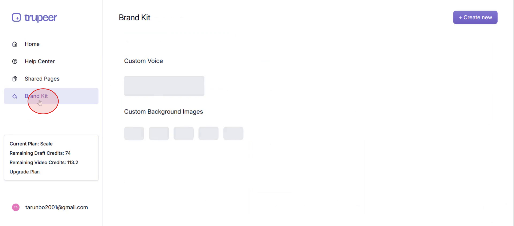
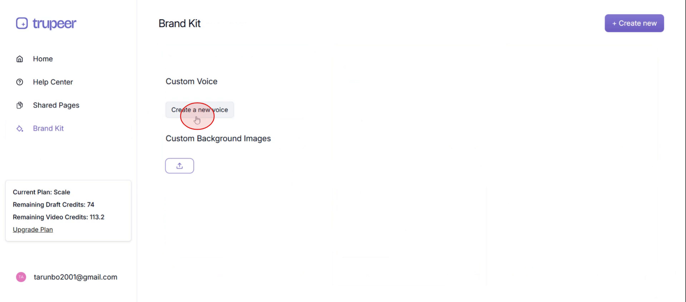
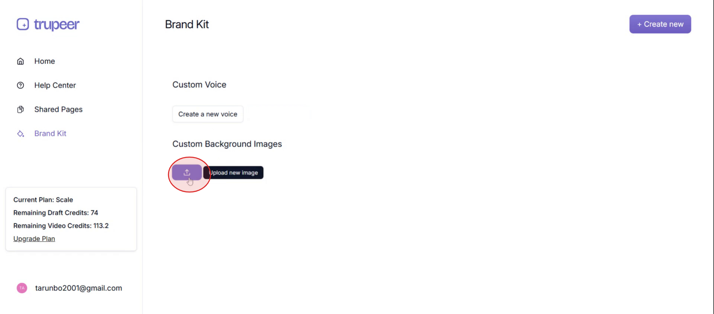

This document explains how to use the brand kit in Trupeer to customize your videos with unique voices and background images. Follow the steps below to seamlessly integrate your branding elements.

### Step 1

Click on **Brand Kit** to start utilizing its features.

### Step 2

Then click on **create a new voice**,

### Step 3

And click on **upload new image**.

That how you use the brand kit feature in Trupeer.
