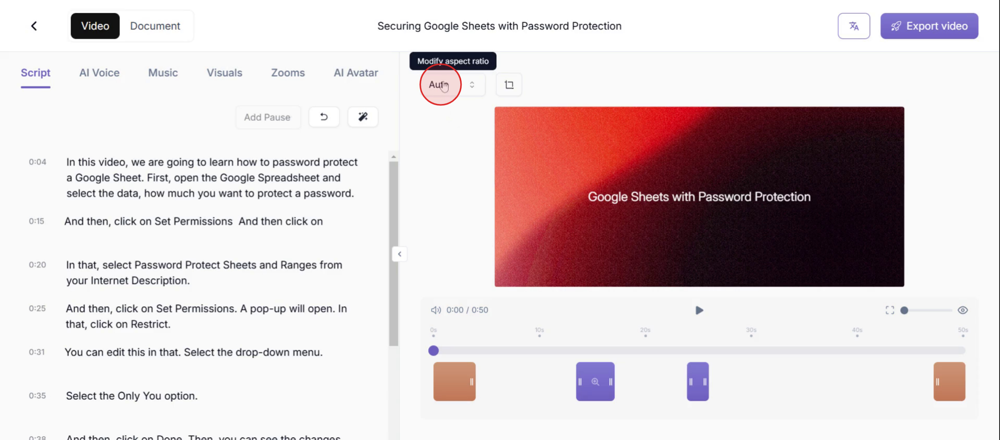
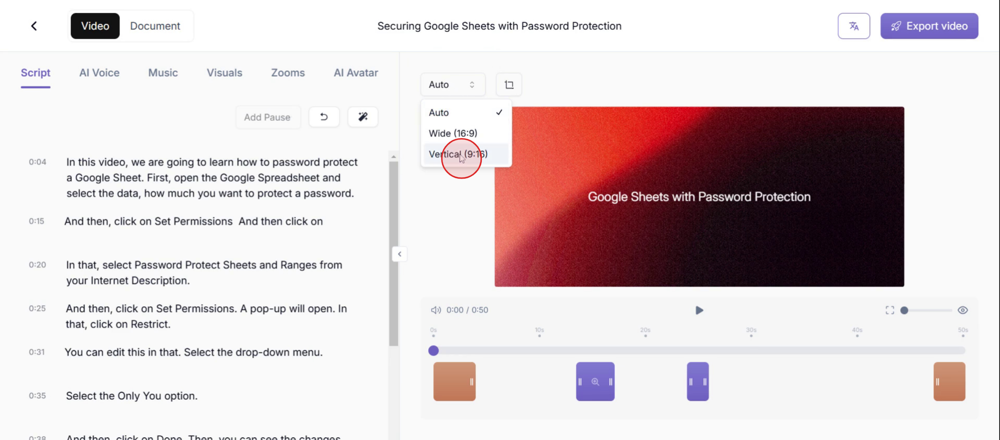

<iframe
  src="https://app.trupeer.ai/embed?slug=PfqUVt"
  className="w-full aspect-video rounded-lg overflow-hidden"
  frameborder="0"
  allowfullscreen="true"
></iframe>

In this process, you'll learn how to adjust your video layout for optimal mobile viewing. By following the steps carefully, you can efficiently modify the aspect ratio, ensuring your video is perfectly formatted for mobile screens.

### Step 1

Click on **Modify Aspect Ratio** button.

### Step 2

Then select **vertical** option.

