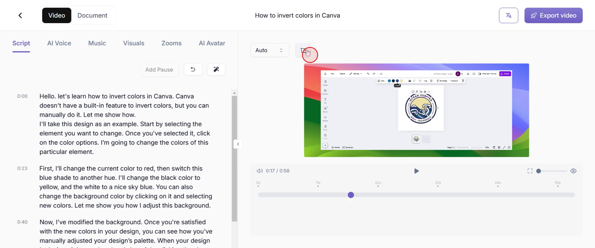
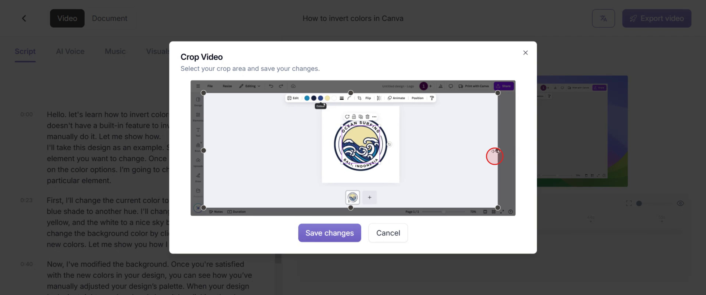
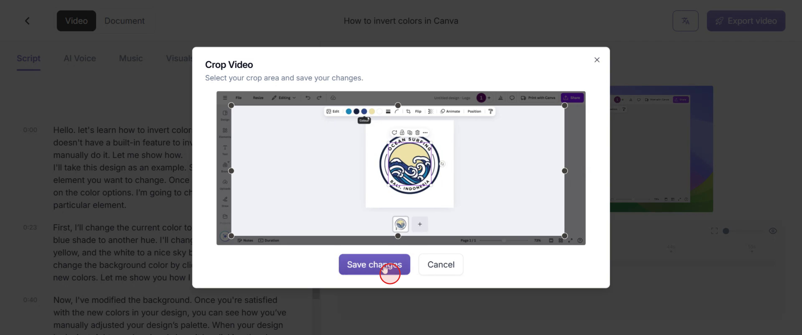
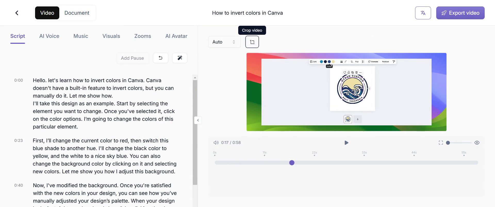

<iframe
  src="https://app.trupeer.ai/embed?slug=TgVWAU"
  className="w-full aspect-video rounded-lg overflow-hidden"
  frameborder="0"
  allowfullscreen="true"
></iframe>

This guide will walk you through the process of cropping a video using Rupyear. Cropping helps eliminate unwanted sections, creating a more refined and professional look. Follow these steps to efficiently crop your video.

### Step 1

Find and select the "Crop Video" option to begin the cropping process.

### Step 2

You can adjust the cropping handles on all four sides to refine the video's framing and focus on the desired content.

### Step 3

&#x20;Click on the "Apply Changes" button to finalize and save your cropped video.

### Step 4

You'll notice that the video has been cropped according to your adjustments, providing the desired framing.

