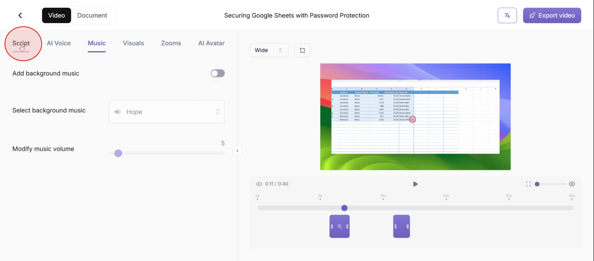
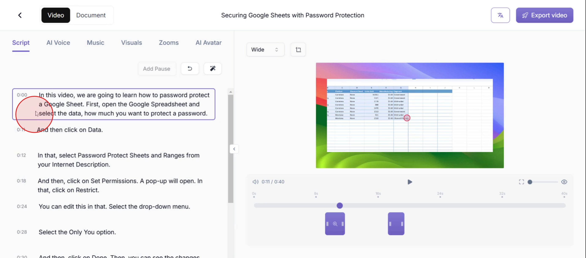
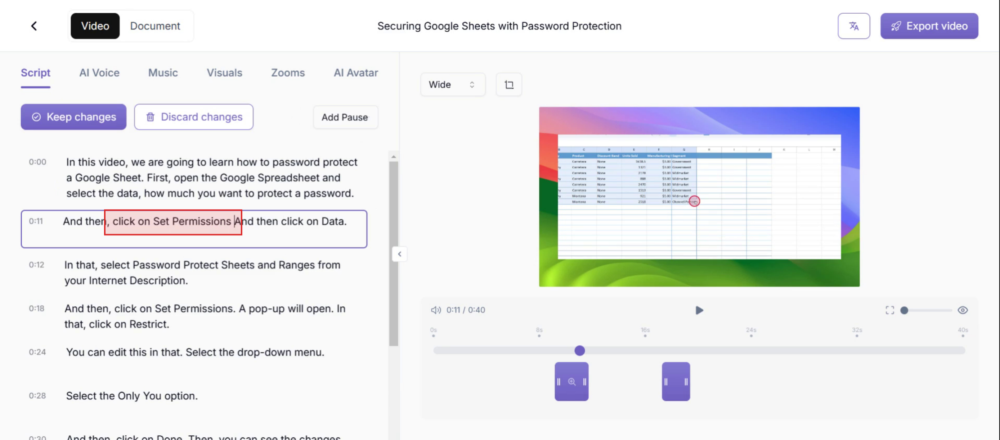
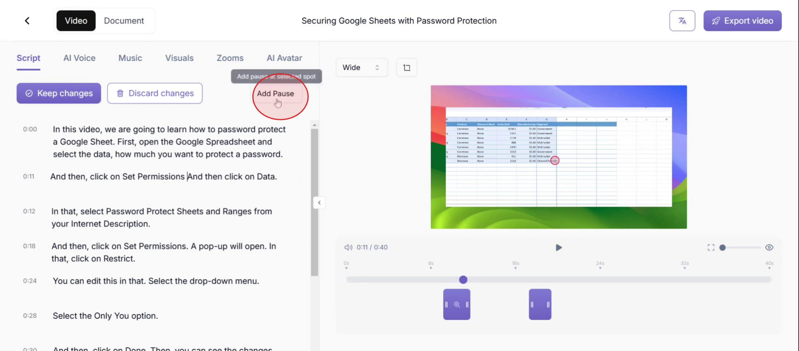
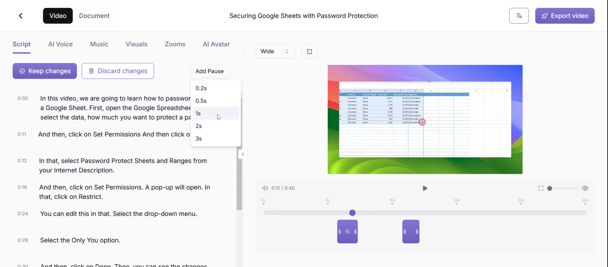
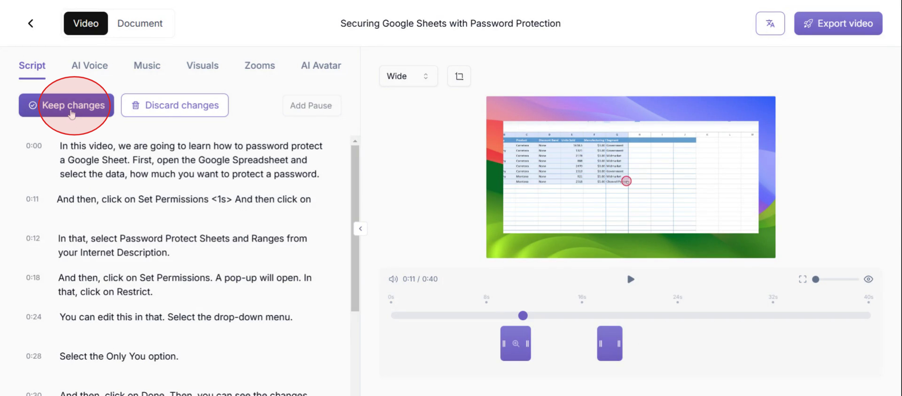
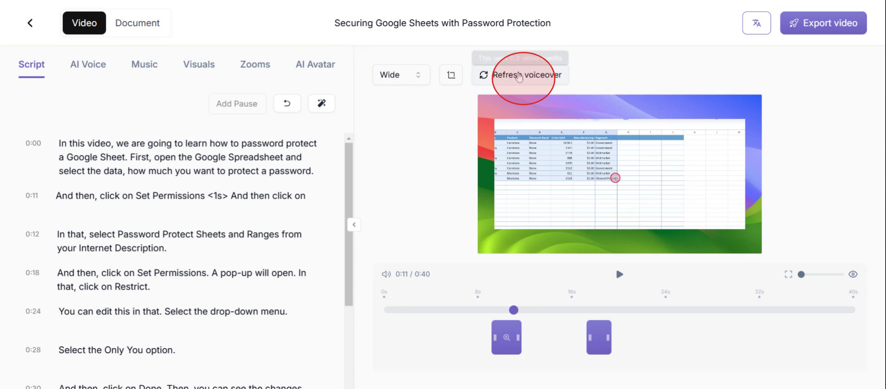

This document provides a comprehensive guide on how to edit scripts in Trupeer. You will learn how to access and modify the script, add pauses, and finalize your changes in a structured manner.

### Step 1

Click on the Script.

### Step 2

Once opened, you'll see the complete AI-generated script.

### Step 3

Now to edit the script, enter the text manually or just copy paste.

### Step 4

To align your script with the video, use the Add Pause option.

### Step 5

Now, using your script, choose the desired pause duration from the "Add Pause" feature.

### Step 6

Now after the edits are made, click on the Keep Changes to save the edits.

### Step 7

Then click on refresh voiceover.

