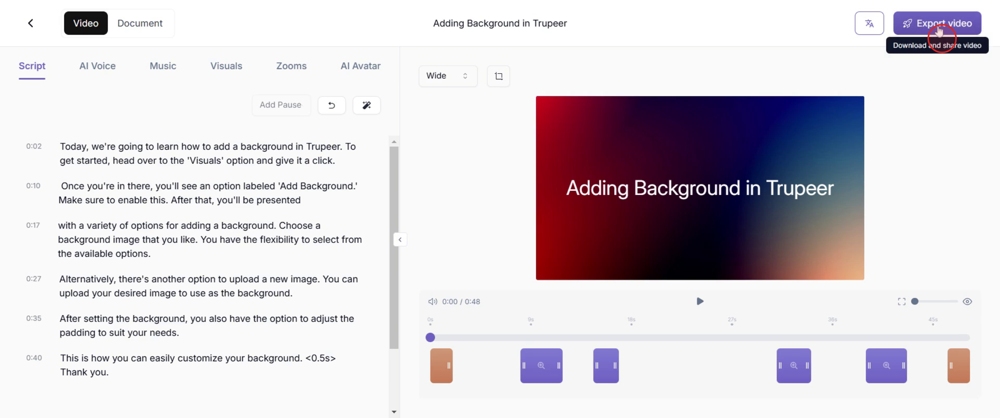
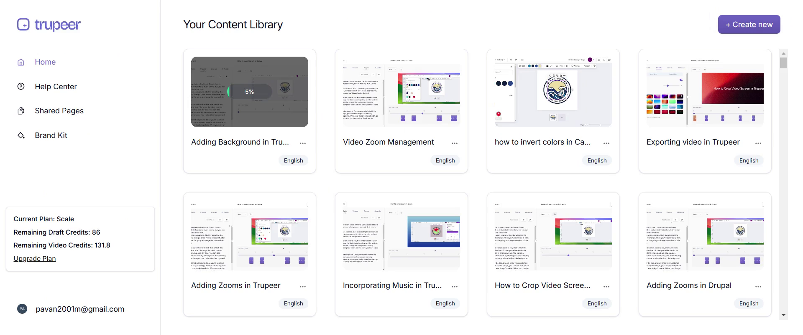
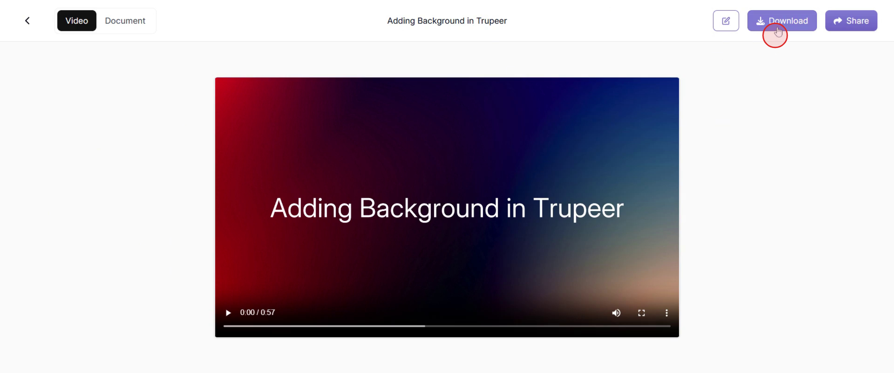
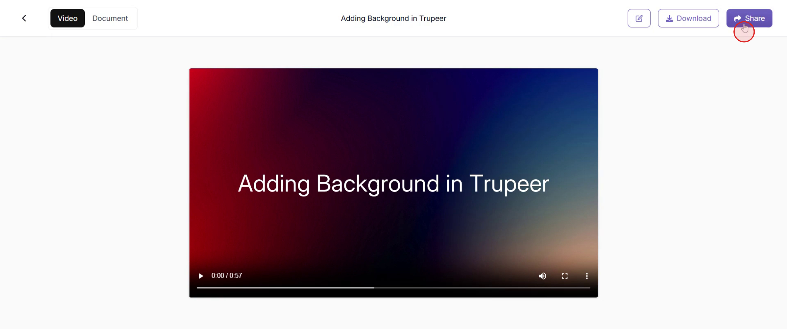

<iframe
  src="https://app.trupeer.ai/embed?slug=9RK39w"
  className="w-full aspect-video rounded-lg overflow-hidden"
  frameborder="0"
  allowfullscreen="true"
></iframe>

This document offers a step-by-step guide on efficiently exporting videos in Trupeer after making all necessary edits.

### Step 1

Once you have completed the edits, locate the "Export Video" option and click on it.

### Step 2

Please allow some time for the processing to complete.

### Step 3

After the process is complete, you will see several options. Click on the "Edit video" option if you need to make further changes.

### Step 4

Click on the "Download" option to save the video to your device.

### Step 5

Click on the "Share" option to share the video directly from the platform.

