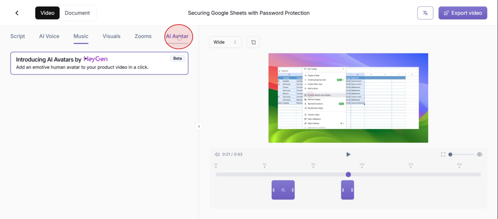
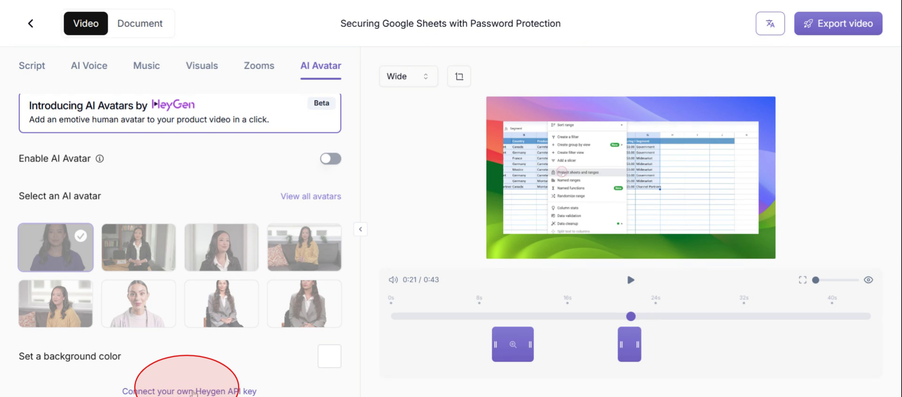
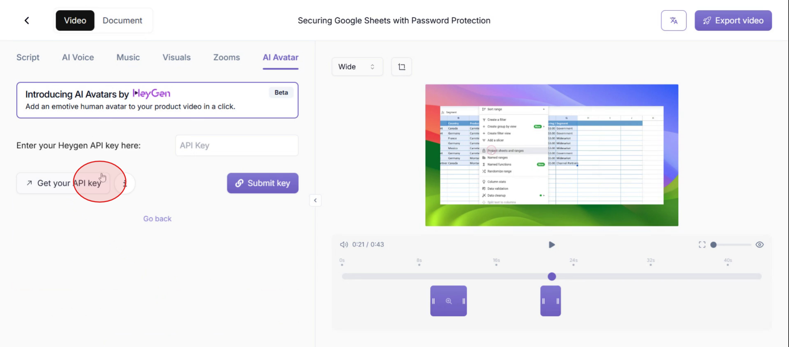
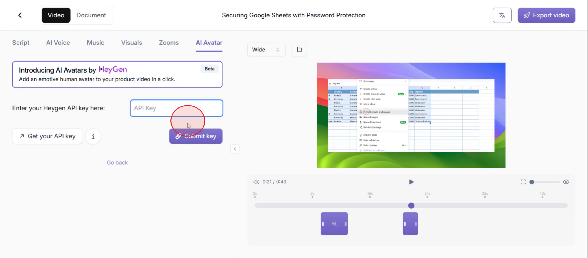
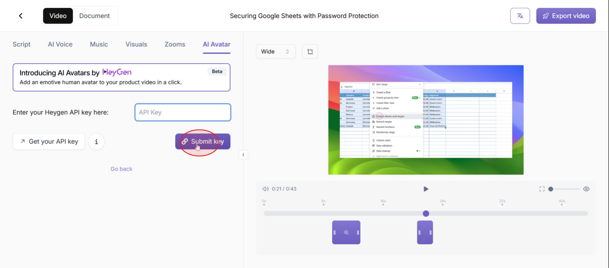
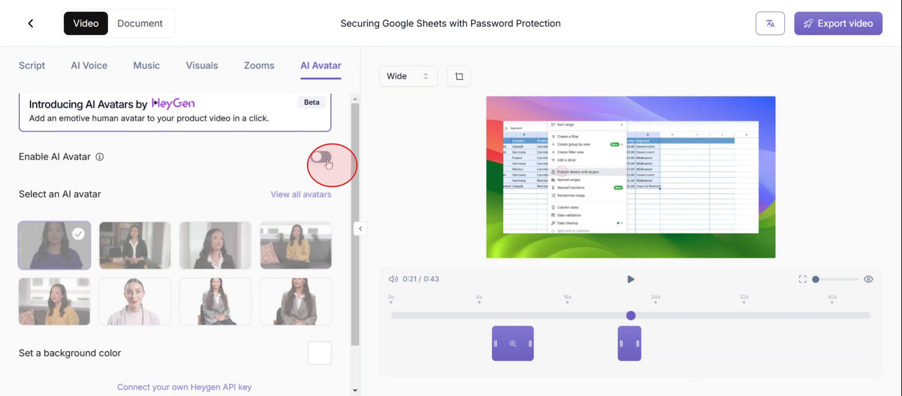
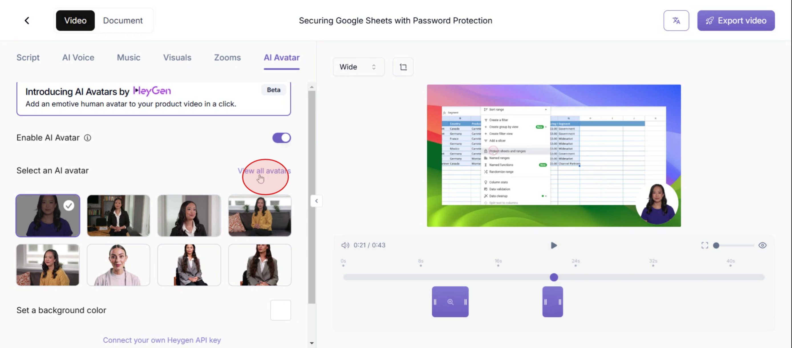
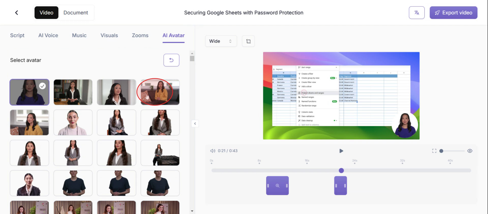

In this tutorial, you'll discover how to effortlessly integrate a Heygen avatar into Trupeer. The process includes connecting your API key, enabling avatar options, and choosing the ideal avatar for your needs. Follow these steps to elevate your video content with personalized avatars.

### Step 1

Click on AI Avatar option

### Step 2

Click on **connect your own Heygen** API key at the bottom of the page.

### Step 3

Select the option of **Get your own API key** .

### Step 4

Then paste it in the API Key section as shown in the screenshot.

### Step 5

And click on **Submit Key**.

### Step 6

And select the **Go Back** option .

### Step 7

Then click on enable AI avatar.

### Step 8

Click on **view all avatars**.

### Step 9

Select the avatar that best suits your requirements.

Thats how you can integrate HeyGen avatars in Trupeer.
