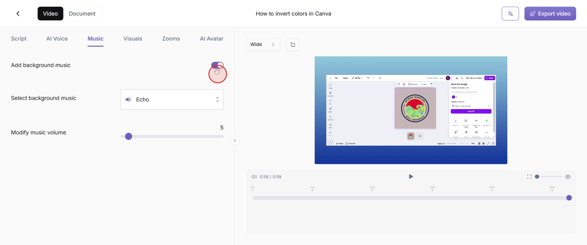
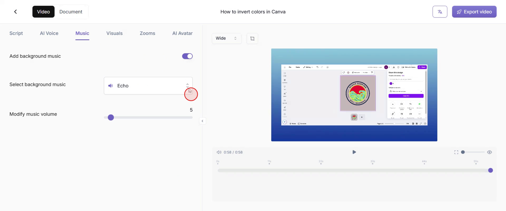
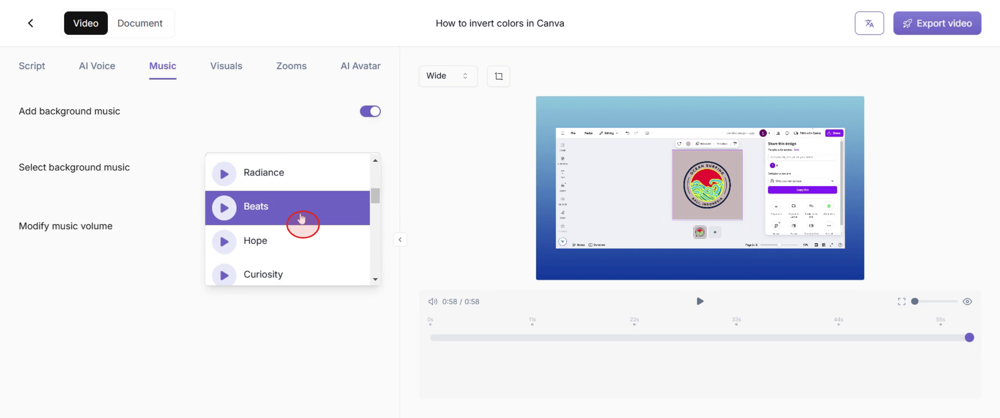
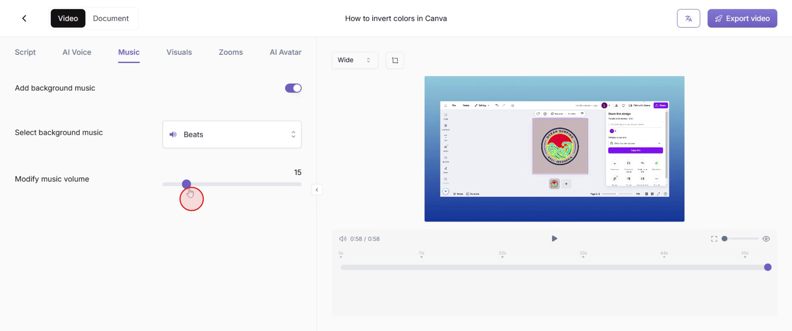

<iframe
  src="https://app.trupeer.ai/embed?slug=6jOPQi"
  className="w-full aspect-video rounded-lg overflow-hidden"
  frameborder="0"
  allowfullscreen="true"
></iframe>

This guide provides a step-by-step process for adding and encrypting background music in Trupeer. Follow these instructions to effortlessly integrate and protect music tracks in your video content.

### Step 1

Go to the "Music" option and click on it to add music.

### Step 2

Turn on the "Add Background Music" option to proceed.

### Step 3

Click on the "Select Background Music" option.

### Step 4

Select the background music that best suits your needs.

### Step 5

You can further adjust the music volume to suit your preferences, ensuring it complements your video seamlessly.

You have now successfully added Music in your Trupeer video.
