In this document, you will learn how to create professional intro and outro slides using the Trupeer platform. Each step will guide you through selecting visuals, adding images, and customizing text to enhance your slide presentations.

### Step 1

Click on Visuals option.

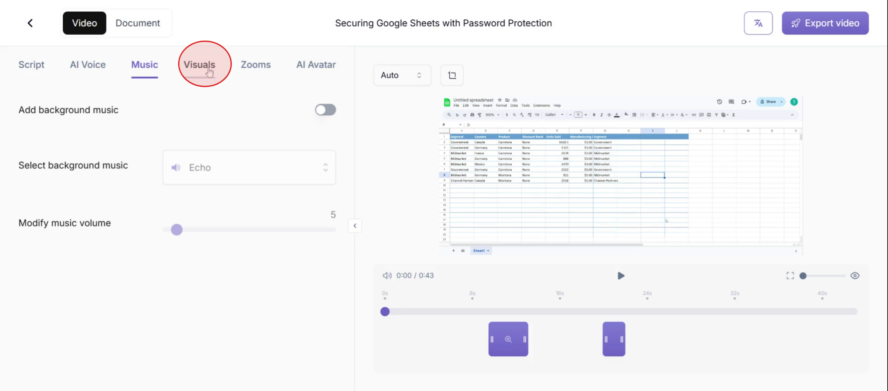

### Step 2

From there, select the **Intro Slide** option.

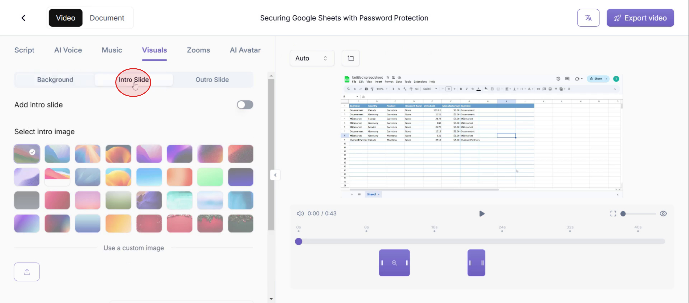

### Step 3

Then enable the **intro slide**.

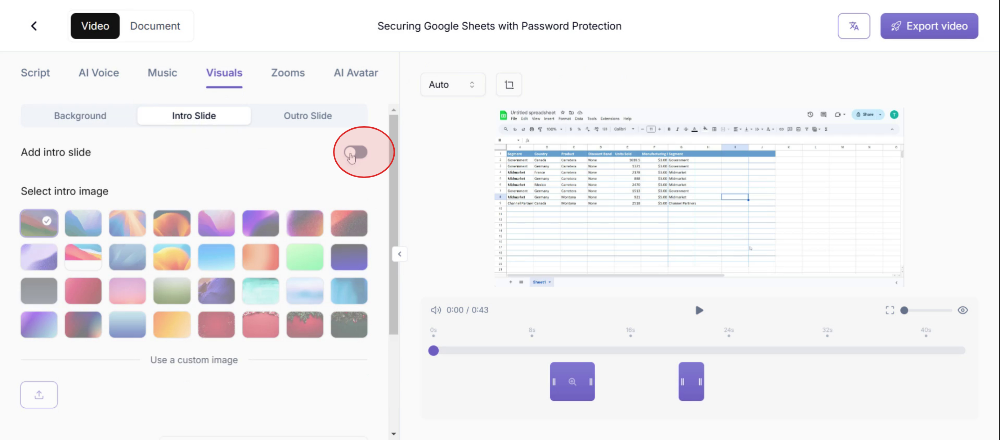

### Step 4

Then select intro slide image for the list of images.

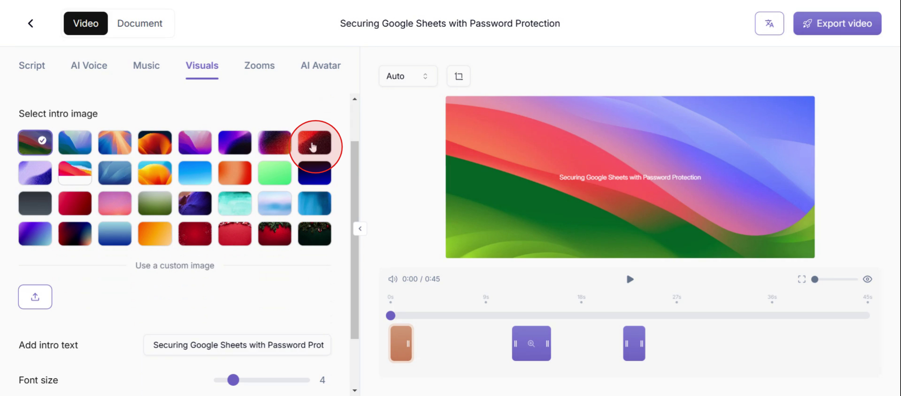

### Step 5

You also have the option to **upload a new image** from the menu.

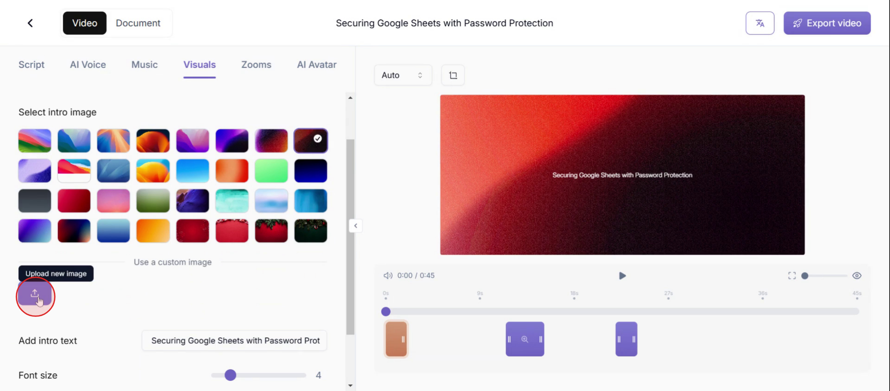

### Step 6

You can also edit the text in the Intro slides.

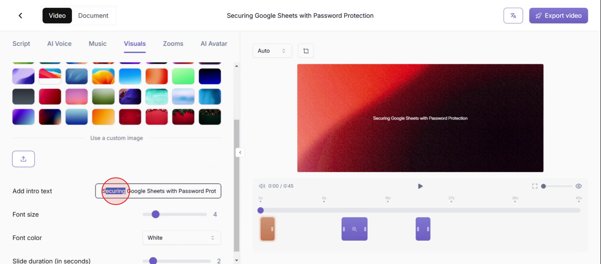

### Step 7

Adjust the font size by dragging or clicking on the size option.

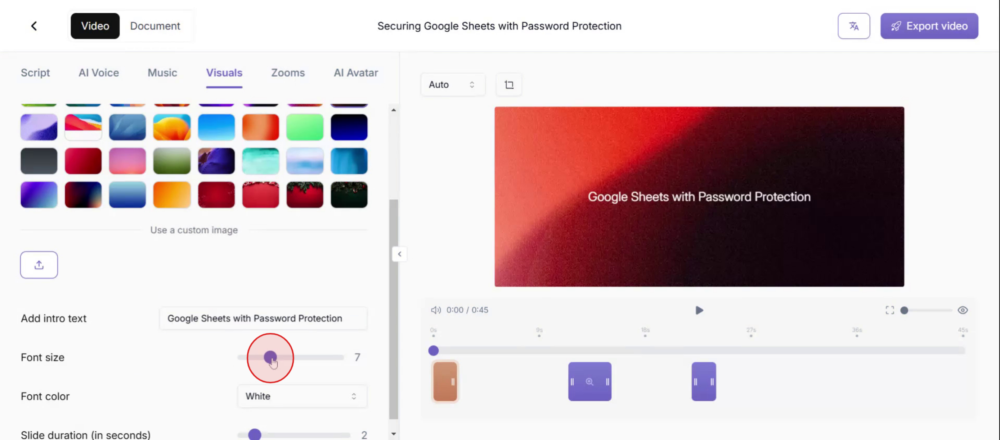

### Step 8

Modify the font color by selecting the font color option.

### Step 9

Adjust the slide duration by dragging the duration slider to your desired length.

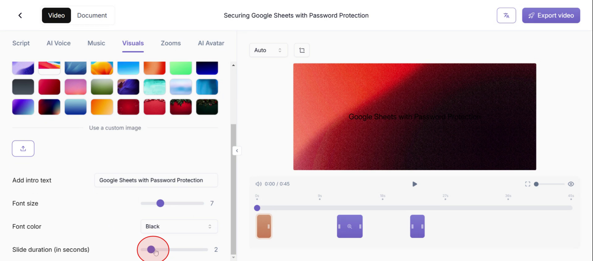

### Step 10

Next, click on the Outro Slide option.

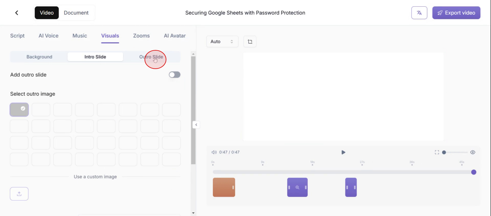

### Step 11

Then enable, **Add outro slide** option. 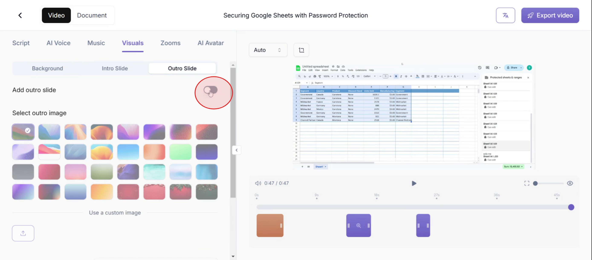

### Step 12

Then **select the image** from the list of images

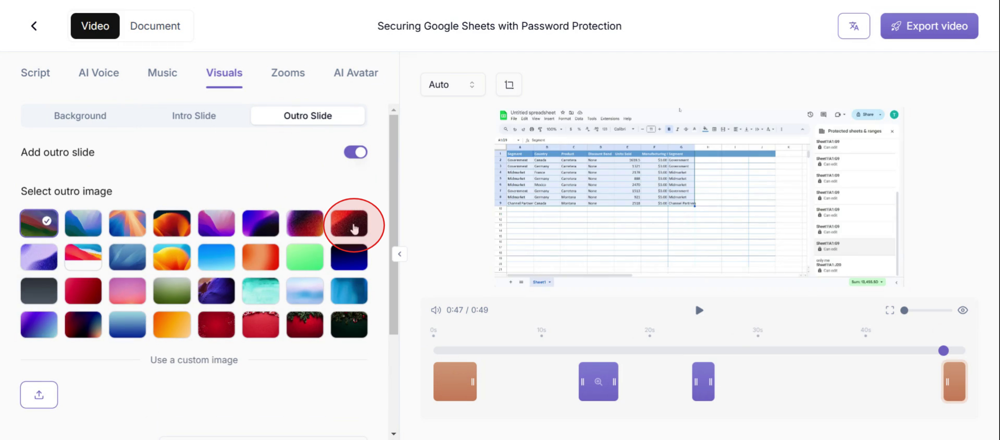

### Step 13

Finally, now you can see the **outro slide.**

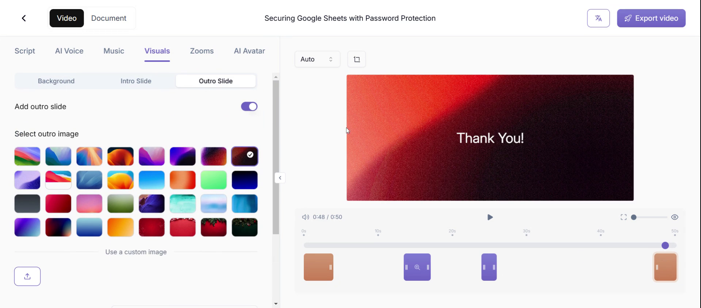
