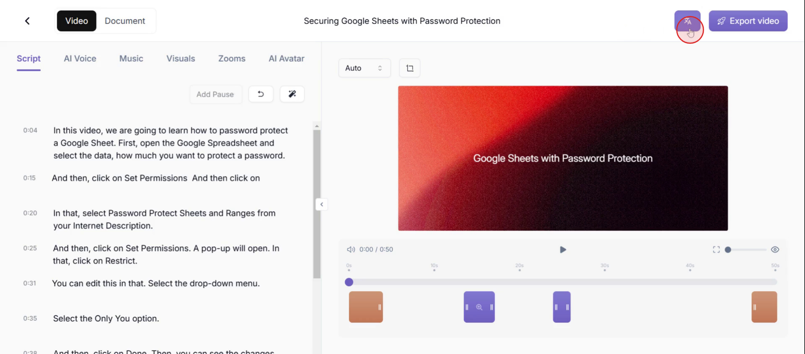
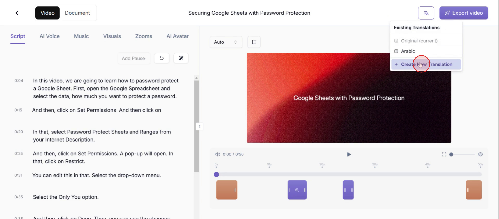
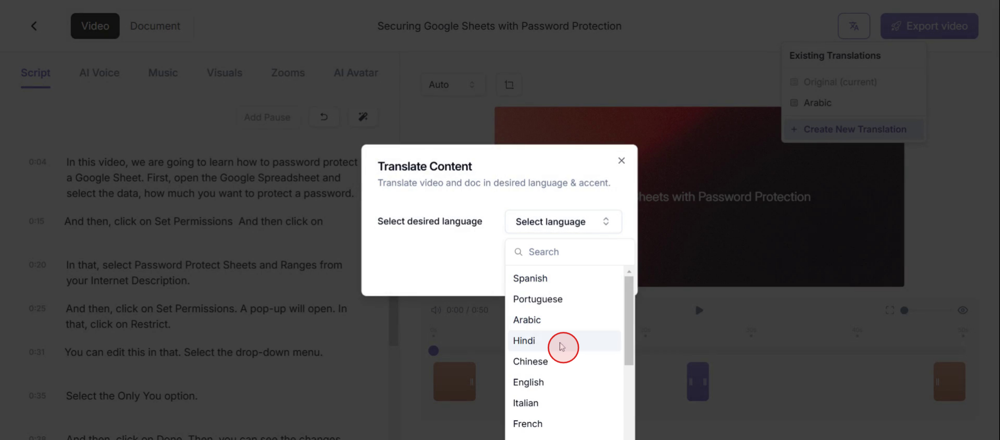
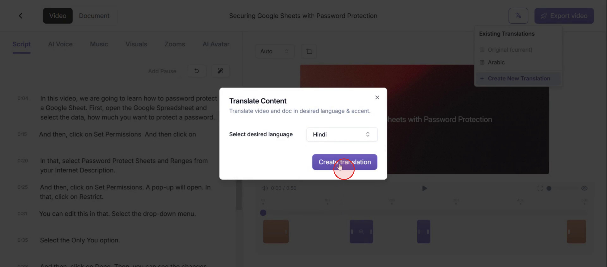
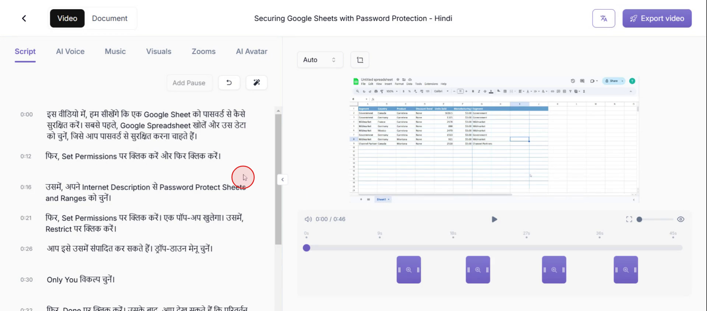

<iframe
  src="https://app.trupeer.ai/embed?slug=m7ZxNz"
  className="w-full aspect-video rounded-lg overflow-hidden"
  frameborder="0"
  allowfullscreen="true"
></iframe>

This document provides a step-by-step process to translate a video into a different language. Follow the steps carefully to ensure a smooth translation process.

### Step 1: Accessing Translation Features

First, click on the **translate** option on the top right corner.

### Step 2: Initiating a New Translation

Next, select the option **Create New Translate**.

### Step 3: Selecting Target Language

Select the **language** from the drop-down menu.

### Step 4: Confirming Translation Creation

Now click on **Create Translation.**

### Step 5: Reviewing Translated Content

You will see the **content translated** into the selected language.

