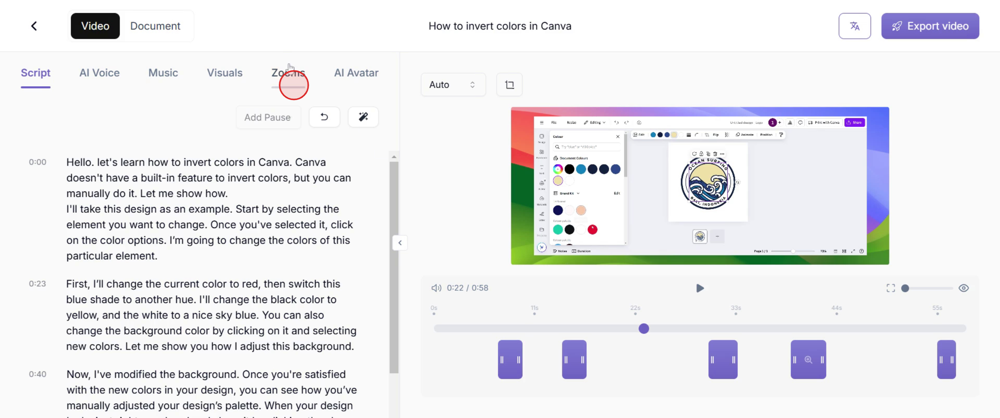
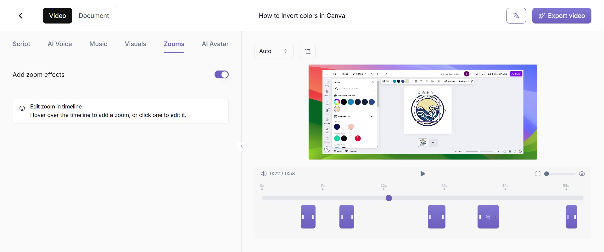
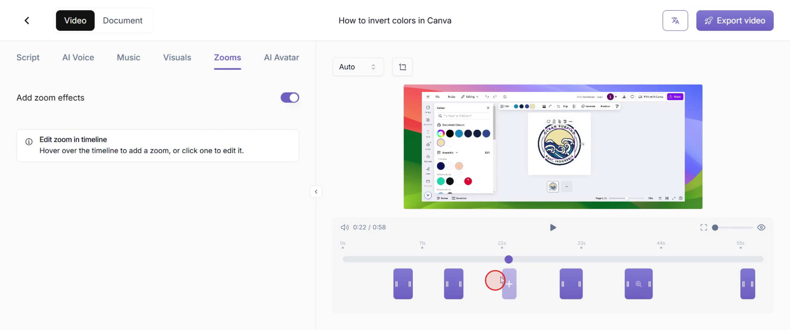
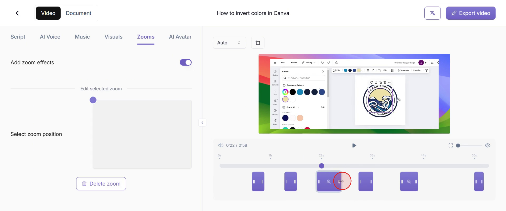
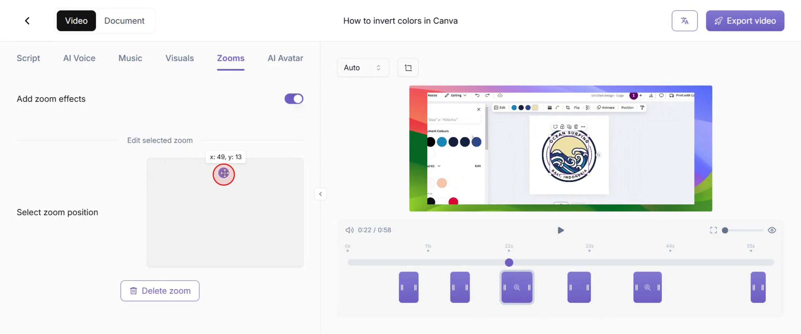

<iframe
  src="https://app.trupeer.ai/embed?slug=kkN8b0"
  className="w-full aspect-video rounded-lg overflow-hidden"
  frameborder="0"
  allowfullscreen="true"
></iframe>

This guide provides a step-by-step approach to adding zoom effects to videos in Trupeer. Follow these instructions to apply precise zooms at specific moments, enhancing the visual impact of your video content.

### Step 1: Access Zoom Controls

To manually add zoom effects, go to the "Zooms" option and click on it.

### Step 2: Enable Zoom Feature

Make sure the 'Zooms' option is enabled before proceeding with adding zoom effects.

### Step 3: Select Timeline Position

Choose the exact point in the video timeline where you want to apply the zoom effect.

### Step 4: Configure Zoom Parameters

Adjust the zoom effect as per your requirements, tailoring the focus and scale to fit your vision.

### Step 5: Fine-tune Zoom Settings

Use the control panel to precisely adjust the zoom effect's position, duration, and intensity, ensuring a smooth and professional look.

That's it! This is how you can manually add Zoom effects to your Trupeer videos.
